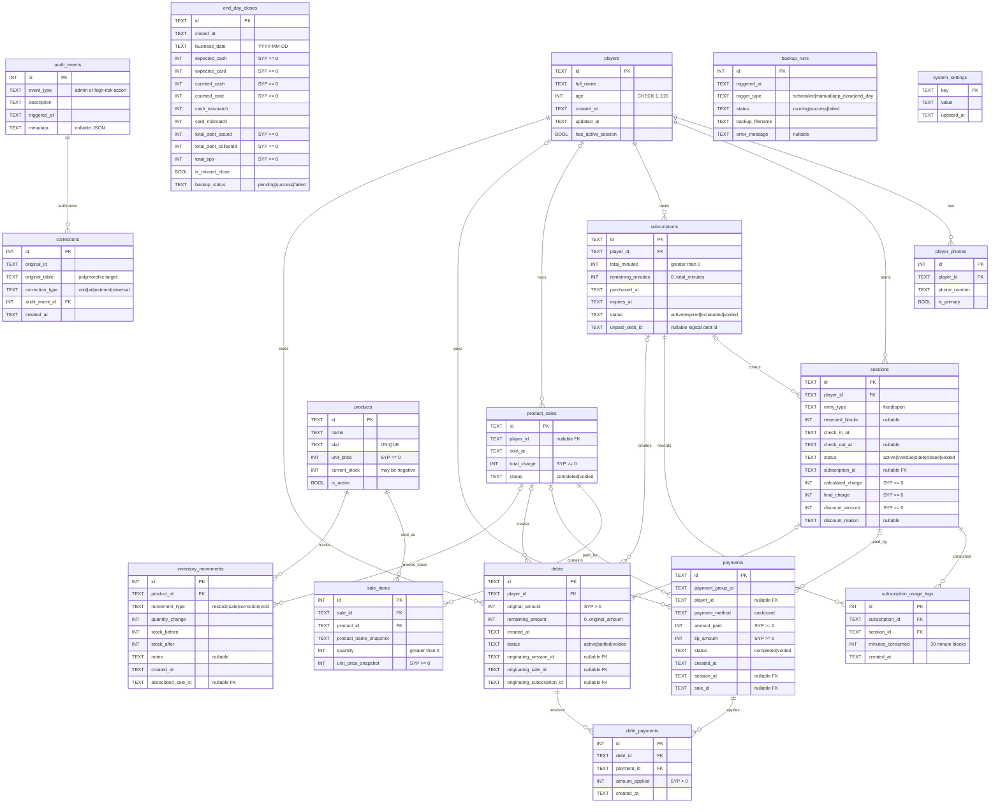

# Database Diagram

This diagram documents the current local SQLite schema managed by Drift.
It is derived from `context/schema-reference.md` and
`lib/core/database/local_database.dart`.

## Current Schema Summary

- Database file: `gravity.db`
- Drift schema version: `1`
- Local SQLite is the offline-first source of truth.
- Runtime connections enable `PRAGMA foreign_keys = ON`.
- Money is stored as integer SYP values.
- Timestamps are stored as UTC ISO-8601 text.
- Normal business workflows do not hard-delete operational records.
- A partial unique index prevents duplicate non-closed sessions for the same
  player:
  `idx_sessions_one_open_per_player ON sessions(player_id) WHERE status IN ('active', 'overdue', 'stale')`.

## Entity Relationship Diagram

## Relationship Notes

- `corrections.original_id` and `corrections.original_table` are polymorphic.
  They point to the corrected business record by table name and primary key,
  while `corrections.audit_event_id` is the enforced foreign key to the admin
  authorization event.
- `subscriptions.unpaid_debt_id` is a logical debt reference. The enforced
  relationship is stored from `debts.originating_subscription_id` back to
  `subscriptions.id` to avoid a circular Drift table graph.
- `product_sales.player_id`, `payments.player_id`, `payments.session_id`,
  `payments.sale_id`, `debts.originating_*`, and
  `inventory_movements.associated_sale_id` are nullable because some workflows
  are anonymous, optional, or created by later correction/payment flows.
- `end_day_closes`, `backup_runs`, and `system_settings` are intentionally
  mostly standalone operational tables. End Day stores a frozen close snapshot,
  backup runs log attempts, and settings store typed values as strings parsed by
  application code.
