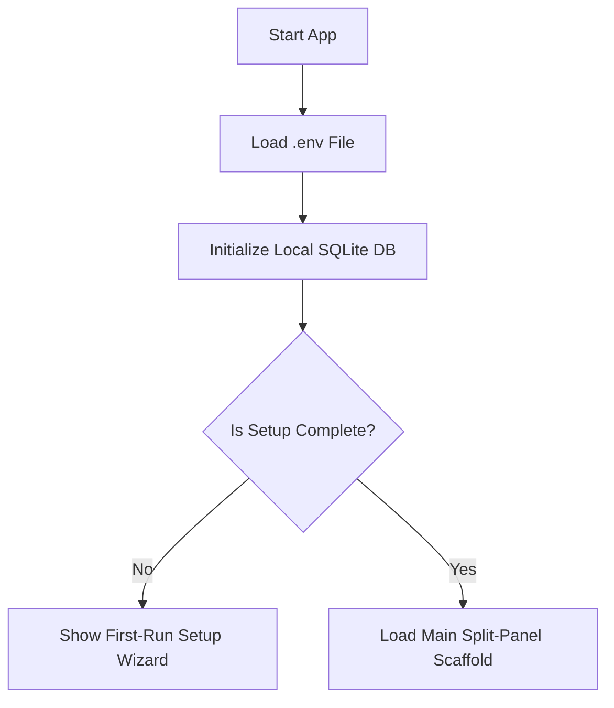

# Feature Spec 01: Foundation Scaffold

## Purpose
The high-level goal of the Foundation Scaffold is to establish a robust, clean-architecture framework for a single-device, offline-first Windows desktop cashier app. It defines the folder hierarchy, baseline dependencies, static analysis rules, test environment configurations, and build-automation guidelines. The foundation ensures developers can write predictable, testable, and highly structured Flutter code without architectural drift.

---

## Build Notes

### Recommended Implementation Slices
Foundation may be implemented as smaller complete slices, but all slices remain
part of this spec:

1. **01a - Flutter Windows scaffold and root project files**: Create the Flutter
   desktop project structure, `pubspec.yaml`, `analysis_options.yaml`, and root
   folders without product feature behavior.
2. **01b - Baseline dependencies and code generation setup**: Add the approved
   packages and generator configuration, then prove generated files can be
   produced repeatably.
3. **01c - Drift database shell and schema baseline**: Create the Drift database
   class, connection helpers, and initial migration structure from
   `context/schema-reference.md`.
4. **01d - App shell and split-panel placeholder**: Render the Windows desktop
   app shell and persistent split-panel placeholder without feature-local UI.
5. **01e - Test harness and verification commands**: Establish in-memory SQLite
   tests, widget harnesses, formatting, analyzer, and test commands.

Do not implement product behavior inside foundation beyond what is required to
prove the scaffold, boundaries, and verification workflow.

### Core Technologies & Libraries
- **Desktop Runtime**: Flutter Desktop for Windows (locked to stable branch).
- **State Management & DI**: `flutter_riverpod` + `riverpod_generator` for type-safe, compile-time checked dependency injection and reactive state.
- **Local Persistence**: `drift` + `sqlite3_flutter_libs` + `path_provider` + `path` for a highly transactional, type-safe SQLite access layer.
- **Data Modeling**: `freezed` + `freezed_annotation` + `json_annotation` for immutable data structures, union types, and value-equality.
- **File Exports**: `pdf` (PDF creation) and `csv` (Excel-compatible CSV files).
- **Configuration & Secrets**: `flutter_dotenv` to load GCP backup credentials from a gitignored local `.env` file.
- **Build Utilities**: `build_runner` for automated code generation.

### Directory Structure Layout
The project follows the architectural boundaries defined in [architecture.md](../architecture.md). Hand-written files must reside strictly within these designated folders:

```text
lib/
├── app/                  # App shell, global routing, l10n setup, base theming, split scaffolds
│   ├── layout/           # Split-panel layout widgets, responsive desktop rules
│   ├── theme/            # Theme tokens, Outfit and Inter font bindings
│   └── routing/          # Route transitions and side rail navigational definitions
├── core/                 # Shared infrastructure, global utilities, offline features
│   ├── database/         # SQLite connection logic, Drift schema, transactional helpers
│   ├── config/           # App-wide settings classes, dot-env loaders, static defaults
│   ├── security/         # Admin password verifiers, short-lived session grants
│   ├── backup/           # Backup packager, GCP Cloud Storage client, restore safeguards
│   ├── export/           # PDF shift report generators, CSV exporters
│   ├── audit/            # Audit ledger writers, database insertion utilities
│   └── logging/          # Local rotating logger, automated upload jobs, data-stripper
├── domain/               # Pure business rules, pricing calculations, domain entities
│   ├── entities/         # Freezed immutable domain models (e.g. Session, Player)
│   └── services/         # Pure Dart calculations (e.g. PricingService, CheckoutService)
├── data/                 # Data mapper implementations and storage interfaces
│   └── repositories/     # SQLite-backed Drift data mapping repositories
└── features/             # Feature slices containing presentation code
    ├── players/          # Profiles, phone management, search, and debt history UI
    ├── sessions/         # Check-in, persistent Active Board, live countdown timers
    ├── checkout/         # Dense individual/group checkout dialogs, payments, splits
    ├── subscriptions/    # Multi-hour cards, usage logs, block countdowns
    ├── products/         # Product catalog cataloging, pricing and inventory UI
    ├── inventory/        # Stock ledger movement history, restock forms
    ├── corrections/      # Void/reversal UI, correction authorization dialogs
    ├── reports/          # Cashier close UI, expected vs counted totals, frozen snaps
    ├── settings/         # Price updates, leeway settings, stale thresholds settings UI
    └── setup/            # Setup wizard (admin credentials, skip-able GCP test, socks/water pre-fill)
test/
├── domain/               # Domain logic unit tests (independent of Flutter UI)
├── data/                 # Drift SQLite integration, transaction, and migration tests
└── features/             # Riverpod view models and dense UI widget functional tests
```

### Static Analysis and Code Generation
To prevent low-quality code, formatting inconsistencies, and broken builds:
1. **Analysis Rules**: The project extends `flutter_lints` with custom rules in `analysis_options.yaml`. Strong mode is enabled to enforce strict type checks:
   ```yaml
   analyzer:
     language:
       strict-casts: true
       strict-inference: true
       strict-raw-types: true
     exclude:
       - "**/*.g.dart"
       - "**/*.freezed.dart"
   ```
2. **Code Generation command**: All generated files must be built using `build_runner`. Developers run:
   ```powershell
   flutter pub run build_runner build --delete-conflicting-outputs
   ```
3. **Format Enforcement**: Code must pass `dart format --set-exit-if-changed .` before commit.

---

## Data/Domain/Storage

### Repository Patterns & Boundaries
All database access must go through Repositories located in `lib/data/repositories/`. 
- **Rule**: UI screens, widgets, and Riverpod Notifiers are strictly prohibited from importing Drift classes directly or performing raw queries.
- **Mapping**: Repositories map Drift generated table rows into immutable Freezed domain models (`lib/domain/entities/`).

### Local SQLite Database Baseline Connection (`lib/core/database/`)
A unified Drift database class coordinates thread connection lifecycle and transactional writes. On Windows desktop:
- The database is backed by `sqlite3` via `sqlite3_flutter_libs`.
- The database file is located in the user's local application data folder, retrieved dynamically:
  ```dart
  import 'dart:io';
  import 'package:path_provider/path_provider.dart';
  import 'package:path/path.dart' as p;
  
  Future<File> getDatabaseFile() async {
    final appSupportDir = await getApplicationSupportDirectory();
    return File(p.join(appSupportDir.path, 'gravity.db'));
  }
  ```
- Refer to [schema-reference.md](../schema-reference.md) for full schema structure. The foundation scaffold sets up Drift migrations with an initial version schema (`version: 1`).

---

## UI and Workflow

### App Entry Point Flow (`lib/main.dart`)
At startup, the app loads configurations synchronously, initializes database connections, and checks if first-run setup is complete:



Placeholder scaffold UI should use minimal localization keys once the l10n
infrastructure exists. Product feature screens must not add hardcoded
user-facing strings; implement `03-localization-infrastructure.md` before real
feature UI work begins.

### Desktop Split-Panel Scaffold Layout
The app utilizes a layout optimized specifically for cashier desks using 1080p desktop monitors:

- **Window Constraints**: Managed via a window management package (e.g., `window_manager`). The window size is restricted to a minimum width of `1024` and minimum height of `768`, defaulting to `1920x1080` maximized.
- **Layout Blueprint**:
  - A persistent sidebar navigation rail on the far left.
  - A main horizontal split-panel container.
  - **Left Split Panel (60% width)**: Always shows the active player board, timers, and alerts. This panel remains active and visual during all operations.
  - **Right Split Panel (40% width)**: Dynamic "Context & Action Panel". When a cashier creates a player, performs inventory restocks, or processes a checkout, the visual forms load here without hiding the active board.

| Sidebar (Thin Rail) | Active Board Panel (60% Width, Persistent) | Context & Action Panel (40% Width, Dynamic) |
| :--- | :--- | :--- |
| Players<br>Products<br>Inventory<br>Reports<br>Settings | **Active Check-ins Board**<br>- Player Timer List<br>- Near-End / Overdue alerts<br>- Remaining-Time progress indicators | **Dynamic Work Context**<br>- Player Creation Form OR<br>- Check-in Configuration OR<br>- Checkout / Billing Calculator |

---

## Edge Cases and Rules

1. **Missing or Corrupt Database**:
   - If the SQLite database file is missing on startup, the system creates it from scratch and forces the user into the First-Run Setup Wizard.
   - If the database file is corrupt (Drift throws SQLite exception on open), the app displays a critical rescue screen, allowing the admin to import a verified GCP backup package, preserving a copy of the corrupted file for developer recovery.
2. **Offline Startup**:
   - The app must start up successfully with full cashier features without an active internet connection. No HTTP API calls or remote auth endpoints are allowed on startup.
3. **Resizing Limitations**:
   - Windows desktop resize operations must not break layout boundaries. The layout uses flexible flex sizing and layout-bounded scroll areas. Font sizes and button targets must remain fixed and readable at 1080p.
4. **Out-of-Sync Code Generation**:
   - CI/CD build scripts must compile with code gen files pre-generated. The CI build must run build_runner, and verify that no generated files were committed with out-of-date contents.

---

## Tests and Verification

### Environment Isolation & In-Memory SQLite Setup
All tests are isolated from the host operating system. To test the database repository layer, Drift is initialized with an in-memory `sqlite3` database to prevent side effects.

- **SQLite In-Memory Provider Setup**:
  ```dart
  import 'package:drift/native.dart';
  import 'package:test/test.dart';
  
  // Instantiating a clean in-memory database per test run
  DatabaseConnection getInMemoryConnection() {
    return DatabaseConnection(NativeDatabase.memory());
  }
  ```

### Target Unit and Widget Scenarios
1. **Repository Serialization Unit Test**:
   - Verify that database rows mapped from Drift are accurately serialized into domain objects (e.g. checking `Player` or `Session` fields match).
2. **Desktop Layout Splitting Widget Test**:
   - Setup a test harness running at standard 1920x1080 resolution.
   - Verify both Left Split Panel and Right Split Panel are visible simultaneously.
   - Resize viewport simulation to 1024x768 and verify no layout constraints overflow.
3. **Offline Persistence Integration Test**:
   - Save a record to in-memory Drift, query the repository, and assert that values persist exactly as written.

---

## Acceptance Checklist

- [ ] Folder structure under `lib/` matches spec with no extraneous top-level packages.
- [ ] `analysis_options.yaml` configured with strict types (`strict-casts: true`, `strict-inference: true`, `strict-raw-types: true`).
- [ ] `pubspec.yaml` contains all base dependencies: Riverpod, Drift, Freezed, pdf, csv, and flutter_dotenv.
- [ ] `build_runner` generates all files (`*.g.dart`, `*.freezed.dart`) with zero compilation warnings.
- [ ] In-memory SQLite connection utility written and verified in unit testing workspace.
- [ ] A mock desktop split-panel widget can load at 1920x1080 and 1024x768 resolutions without rendering overflow lines.
- [ ] Database file resolves correctly to local app support directories on Windows.
- [ ] CI pipeline script configured to run formatting check, analyzer check, build code generator, and verify zero warnings.

---

## What success looks like
An operational Windows desktop environment that compiles cleanly using the custom formatting toolchain. On launching the app on a Windows 10/11 laptop (1080p resolution), a minimum window size is enforced, loading a split-screen dashboard displaying a mock active player list on the left and an empty status view panel on the right. Zero lint analyzer warnings remain in the codebase.
