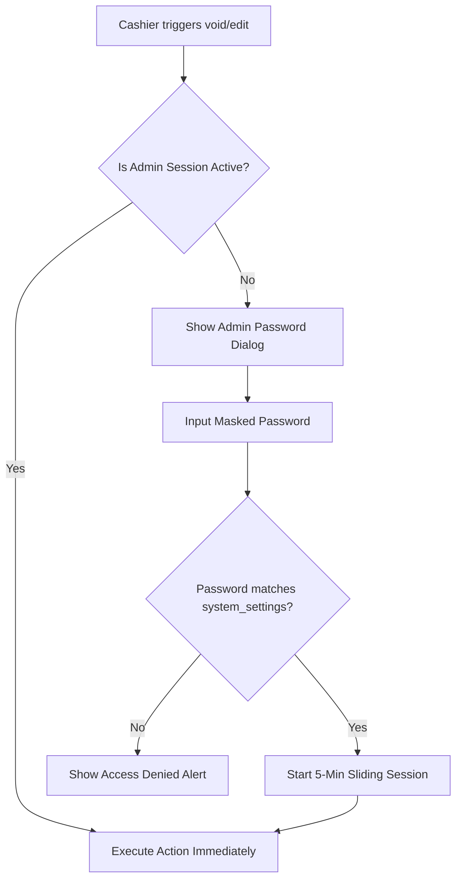

# Feature Spec 06: Admin Auth and Audit Infrastructure

## Purpose
The Admin Auth and Audit Infrastructure establishes a secure, robust operational boundary separating day-to-day employee cashier tasks from restricted administrative system actions. It handles plaintext admin password verification, maintains a short-lived administrative authorization state (5-minute sliding session), and enforces a transactional audit ledger (`audit_events`) in SQLite. This ensures all high-risk adjustments—such as pricing updates, transaction voids, stale session overrides, and cloud database restores—are authorized and durably recorded.

---

## Build Notes

### Core Modules & Locations
- **Authentication Service**: `lib/core/security/admin_auth_notifier.dart` manages the global active admin session state (using a Riverpod view model).
- **Audit Logger**: `lib/core/audit/audit_service.dart` handles database writing of audit events.
- **UI Prompt**: `lib/core/security/admin_password_dialog.dart` provides the unified secure password check modal.

### Key Libraries
- `flutter_riverpod` for session state tracking.
- `drift` for SQLite transaction bounds.

---

## Data/Domain/Storage

### Database Tables & Schema Connections
The infrastructure interacts with three tables defined in [schema-reference.md](../schema-reference.md):
1. `system_settings`: Used to retrieve the plaintext password stored under the key `'admin_password'`.
2. `audit_events`: Durable ledger recording each protected administrative action.
3. `corrections`: Links original adjusted records to their corresponding audit logs.

### Audit Event Types Catalog (`audit_events.event_type`)
To support clean reporting and scanning, audit events must use one of these standard identifiers:

| Event Type Name | Operational Action Triggering the Event |
| :--- | :--- |
| `'price_change'` | Modifications to jump pricing models or product base rates |
| `'settings_update'` | Adjustments to leeway grace periods, stale thresholds, or passwords |
| `'stale_correction'` | Editing or forcing manual checkout on a timer marked stale |
| `'manual_void'` | Voiding complete check-ins, product sales, or subscriptions |
| `'debt_correction'` | Manually adjusting or reversing a player's outstanding debt |
| `'backup_restore'` | Executing a database recovery or cloud restore action |

### Audit Metadata Schema (`audit_events.metadata`)
Metadata is written to SQLite as a serialized JSON string. All events must follow a structured schema:

```json
{
  "reason": "Correcting stale checkout due to system crash",
  "actor": "Admin",
  "changed_fields": {
    "leeway_minutes": {
      "old": 10,
      "new": 15
    }
  },
  "target_records": {
    "session_id": "6c8b9a12-87f5-4e3a-92c1-d576a8bcf492"
  }
}
```

---

## UI and Workflow

### Admin-Protected Access Workflow
When a cashier invokes a protected action (e.g. voiding a transaction inside the cashier panel or editing settings):



### Admin Password Dialog UI Design
The password prompt is a compact modal dialog that matches the **Modern Cashier Calm** design tokens:
- **Input Field**: Automatically focused at load, masked characters, and clear "Enter Password" helper.
- **Keyboard Hook**: Pressing `Enter` in the field automatically triggers the "Verify" submit action.
- **Session Indication**: A small, unobtrusive header badge (Status Active Green, text: "Admin Mode Active - 04:59") displays in the top bar of the settings screen when the session is unlocked, featuring a "Lock System" button.

### Audit Events Grid Panel
Inside the Settings panel (requires active admin session), administrators can view a high-density, paginated grid displaying recent audit actions:

| Timestamp (Damascus Time) | Action Type | Targeted Record / ID | Reason | Changed Details |
| :--- | :--- | :--- | :--- | :--- |
| `2026-05-22 14:10:05` | `price_change` | `pricing_matrix_json` | "Seasonal update" | `60min: 15k -> 18k` |
| `2026-05-22 15:42:18` | `manual_void` | Session: `6c8b9a...` | "Double entry err" | `Status: active -> void` |

---

## Edge Cases and Rules

1. **Plaintext Password Storage Decision**:
   - **Rule**: As established in project goals, the admin password is saved as **plaintext** in SQLite. 
   - **Security Bounds**: System backup packaging scripts (described in architecture specs) exclude GCP credentials, credentials configurations (`.env`), and developer logs. However, because SQLite is packaged intact during backup runs, database backup packages uploaded to the cloud **will** include the plaintext password. This is a deliberate product tradeoff for v1 offline reliability.
2. **Transactional Auditing Rule (Non-Negotiable)**:
   - **Invariant**: High-risk database mutations must be wrapped inside atomic SQLite transactions that include the corresponding `audit_events` insertion.
   - **Rule**: If the audit record insertion fails (e.g. due to constraint violations or database write locks), the primary administrative mutation (the price change or the transaction void) **must be rolled back immediately** to prevent unaudited operations.
3. **Session Sliding Expiry Timer**:
   - The admin session remains valid for exactly **5 minutes** from the last recorded administrative activity.
   - Any further administrative action resets the timer back to 5:00.
   - Closing the app or locking the screen terminates the session immediately.

---

## Tests and Verification

### Session Lifecycle and Transaction Tests
1. **Plaintext Verification Unit Test**:
   - Set `'admin_password'` to `'myPassword123'` in the database repository.
   - Verify that checking `'wrongPass'` returns `false`.
   - Verify that checking `'myPassword123'` returns `true`.
2. **Admin Session State Lifecycle Test**:
   - Setup a Riverpod state provider.
   - Trigger a successful password validation. Assert `state.isAuthenticated` is `true`.
   - Fast-forward the test scheduler clock by 5 minutes and 1 second.
   - Verify the state automatically transitions back to `isAuthenticated = false`.
3. **Audit Logger Transaction Rollback Integration Test**:
   - Setup a Drift mock connection that forces an SQL exception whenever a row is written to the `audit_events` table.
   - Attempt to perform an administrative database mutation (e.g. voiding a session).
   - Assert that:
     1. The void action throws a custom exception.
     2. The session record is **not** mutated in the database (asserting database transaction rollback succeeded).

---

## Acceptance Checklist

- [ ] Plaintext `'admin_password'` key resolves to SQLite `system_settings` table through Drift repository.
- [ ] Admin password modal masks text inputs and auto-focuses input field upon rendering.
- [ ] Administrative password modal verification hooks keyboard `Enter` actions for speed.
- [ ] Unlocking admin access registers a Riverpod view model that manages session state.
- [ ] Active admin sessions automatically expire after exactly 5 minutes of inactivity.
- [ ] Admin panel headers display active session countdown duration and a functional "Lock System" button.
- [ ] Business actions mapped to the Audit Events Catalogue wrap mutations and audit writes inside atomic SQLite transactions.
- [ ] Auditing database failures cause immediate rollbacks of high-risk mutations.
- [ ] Plaintext passwords and local credentials configurations are excluded from backup packaging routines.

---

## What success looks like
A cashier attempts to void a duplicate check-in. The app blocks the action and prompts them with a masked admin password modal. The operator types the plaintext admin password and presses Enter. The dialog disappears, displaying an "Admin Mode Active" countdown badge in the app header, and permits the void action. Under the hood, Drift executes an atomic database transaction that updates the session status, logs the reversal audit details, and records a structured audit event in SQLite. If five minutes pass without further changes, the session expires silently, locking administrative panels.
