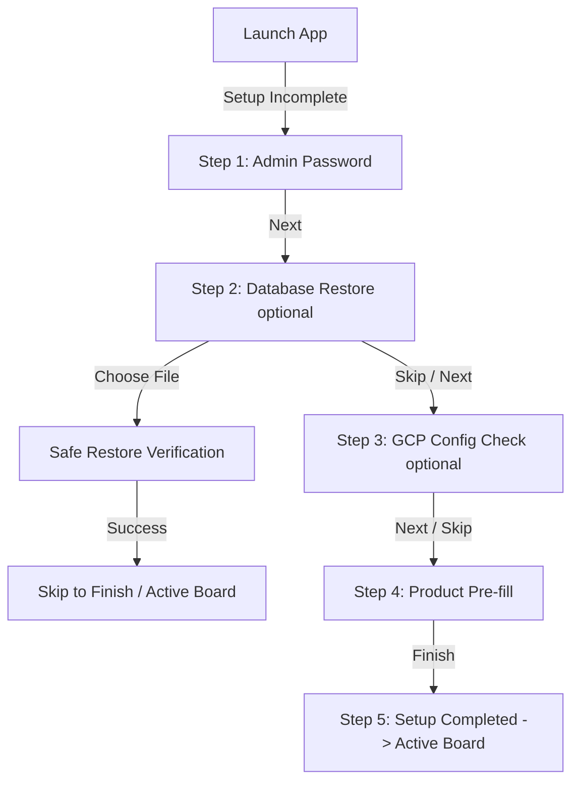

# Feature Spec 07: First-Run Setup and Restore

## Purpose
The First-Run Setup wizard ensures that every fresh application installation is properly initialized before any business or cashier actions occur. It guides the user through setting up the local administrator password, optionally restoring a prior database safely, checking local cloud backup configuration, and pre-filling baseline inventory products (socks and water).

---

## Build Notes
- **Language & Runtime**: Dart & Flutter (Windows desktop layout).
- **State Management**: Riverpod (`StateNotifierProvider` or `NotifierProvider` tracking a step state machine).
- **Database & Persistence**: Drift with SQLite.
- **Folder Structure**:
  - `lib/features/setup/presentation/` (Widgets: `setup_wizard_screen.dart`, `admin_password_step.dart`, `gcp_config_step.dart`, `catalog_init_step.dart`, `restore_step.dart`, ViewModels: `setup_notifier.dart`)
  - `lib/core/backup/` (Safe restore utilities: `database_restore_helper.dart`)

---

## Data/Domain/Storage
This feature reads and writes to the `system_settings` and `products` tables.

Refer directly to:
- [`context/schema-reference.md#16-system_settings`](../schema-reference.md#16-system_settings) for settings storage.
- [`context/schema-reference.md#6-products`](../schema-reference.md#6-products) for catalog items.

### Settings Keys Written During Setup
- `'admin_password'`: Stored as plaintext in SQLite per architectural decisions.
- `'setup_complete'`: Set to `'1'` upon completion.
- `'gcp_enabled'`: Set to `'0'` during setup. Feature 07 only checks whether
  local `.env` cloud configuration is present; a later backup service must
  perform a real authenticated bucket verification before enabling cloud
  backup status.

---

## UI and Workflow

### Layout Context
During first-run setup, the **Persistent Split-Panel layout is completely hidden**. The wizard operates in full-screen mode to enforce strict progression.

### Setup Step Views
1. **Header & Progress Bar**: Standard banner with the trampoline brand styling. Displays progress indicators: `[1. Password] -> [2. Restore] -> [3. Cloud Config] -> [4. Catalog]`.
2. **Step 1: Admin Password Form**:
   - Form field `inputAdminPassword` and `inputConfirmPassword`.
   - Admin password must be at least 6 characters. Matches inputs inline.
3. **Step 2: Database Restore (Optional)**:
   - Option: "Restore from an existing database?"
   - Button `btnSelectDbFile` ("Choose SQLite .db File") triggers Windows file picker.
   - If selected, system performs hot-swap validation. If successful, user skips catalog/cloud setup and proceeds straight to Active Board.
4. **Step 3: GCP Configuration Check (Optional)**:
   - **Instruction**: Explains that GCP credentials (bucket name, service account keys) are read automatically from the gitignored `.env` file in the application directory. Employees do *not* enter keys in UI.
   - Button `btnTestGcp` ("Check Cloud Config") checks for local `.env` bucket and service-account parameters only.
   - Displays a success chip or a calm orange warning dialog: "Cloud config was not detected. Make sure your `.env` file contains GCP bucket and service-account parameters."
   - This step must not set `'gcp_enabled'` to `'1'`; real network/bucket verification belongs to the backup service implementation.
   - Button `btnSkipGcp` ("Skip Cloud Setup") is highly visible, enabling offline-only operation.
5. **Step 4: Product Catalog Initialization**:
   - Displays pre-filled baseline product forms in a dense spreadsheet-style layout:
     - **Row 1**: Name: `"Grippy Socks"` | SKU: `"SOCKS-GRIP"` | Price: `12,000 SYP` | Stock: `100`
     - **Row 2**: Name: `"Bottled Water"` | SKU: `"WATER-500"` | Price: `2,000 SYP` | Stock: `50`
   - Fields are fully editable by the user, with checkboxes to enable/disable pre-filling.
6. **Actions Bar**: Located at the bottom of the screens: "Back" and "Next / Finish" buttons. The Next button is disabled on Step 1 until a valid password is typed.

---

## Edge Cases and Rules

| Rule ID | Operational Scenario | Business Constraint | Action / Enforcement |
| :--- | :--- | :--- | :--- |
| **SU-01** | Empty settings | The app is launched for the very first time. | The app checks the SQLite settings table for `'setup_complete'`. If not found or not `'1'`, the main dashboard is blocked, and the Setup Wizard loads. |
| **SU-02** | GCP Offline | GCP credentials are missing, or internet is offline during setup. | **Allowed**. GCP config check is fully skippable. Setting `'gcp_enabled'` is configured to `'0'` and setup continues normally. |
| **SU-03** | Safe Database Restore | Cashier uploads an invalid, corrupt, incomplete, or pre-setup SQLite database file. | **Strict rollback safety**. The system must:  1. Perform `PRAGMA integrity_check` on the uploaded file. 2. Check for the existence of required schema tables. 3. Verify critical setup rows: `'setup_complete' == '1'` and an explicit non-empty `'admin_password'`. 4. Copy the current draft database to a temporary location (`app_data/safety_copy.db`). 5. Attempt to replace the active database. 6. Roll back to `safety_copy.db` instantly if any exception is thrown. |
| **SU-04** | Plaintext Password | Store the administrator password securely in SQLite. | Under current v1 product decisions, the admin password is saved as plaintext under the SQLite setting key `'admin_password'`. |
| **SU-05** | Double setup prevention | User attempts to navigate back to setup URL after finishing. | Once `'setup_complete'` is `'1'`, the setup router guard intercepts and permanently redirects the user to the Active Board. |

---

## Tests and Verification

### Unit & Domain Service Tests
- **Setup State Machine transitions**:
  - Test that moving back/forward updates step indexes properly and preserves entered password drafts in memory.
- **Admin Password Validation**:
  - Verify password validation helper returns error for `< 6` characters or mismatched passwords.

### Repository & Integration Tests
- **Safe Hot-Swap Database Restore**:
  - Write helper test `DatabaseRestoreHelper.verifyAndRestore(File uploadedFile)`:
    - **Scenario A (Valid SQLite)**: Upload a mock SQLite DB containing correct tables, `'setup_complete' == '1'`, and a non-empty `'admin_password'`. Assert that restore completes, the active SQLite file matches the uploaded file, and a safety copy was generated.
    - **Scenario B (Corrupted / Plaintext File)**: Upload a text file renamed to `.db`. Assert that `PRAGMA integrity_check` fails, throws a `CorruptedDatabaseException`, and leaves the active empty database completely untouched.
    - **Scenario C (Incomplete Setup Rows)**: Upload a valid SQLite file with required tables but missing `'admin_password'`. Assert that restore is rejected and the active database remains untouched.
- **Pre-filled Product Seeding**:
  - Assert that completing setup with pre-fill checks enabled correctly populates the database `products` and `inventory_movements` tables with the two pre-filled products and their initial stock ledger counts.

### Presentation / Widget Tests
- **Button Interactivity**:
  - Build `setup_wizard_screen.dart` with mock Riverpod providers.
  - Verify that the "Next" button on Step 1 is disabled until the cashier enters a password satisfying complexity rules.
  - Verify that clicking "Skip Cloud Setup" successfully navigates to Step 4.

---

## Acceptance Checklist

- [ ] Router guard blocks main screens and forces the First-Run Setup if `'setup_complete'` key is missing or not `'1'` in SQLite.
- [ ] Step 1 enforces a minimum 6-character administrator password, stored as plaintext in SQLite settings.
- [ ] Database restore checks file integrity, required tables, and critical setup rows before replacement, then runs rollback transactions to guarantee zero database corruption.
- [ ] GCP config check is optional and skippable, ensuring the trampoline park works 100% offline.
- [ ] GCP config status loads configurations strictly from local `.env`, never requests manually typed keys, and does not mark cloud backup enabled without a real backup-service verification.
- [ ] Catalog pre-fill displays blue brand-colored grippy socks and bottled water with default quantities, editable by the user.
- [ ] Standard button and text labels follow localization standards (`labelAdminPassword`).
- [ ] All code analyzer checks run clean.

---

## What success looks like
On launching the freshly installed trampoline park app, the cashier is presented with a clean full-screen wizard. They create the admin password `AdminGravity`. Clicking Next, they choose to skip restore. On Step 3, they click "Check Cloud Config"; the app checks the local `.env` variables and shows whether local cloud configuration is present while leaving cloud backup disabled until the backup service verifies the bucket. On Step 4, they review the default stock of 100 grippy socks and 50 waters, click Finish, and are instantly redirected to the split-panel Active Board workspace, ready to check in their first player.
