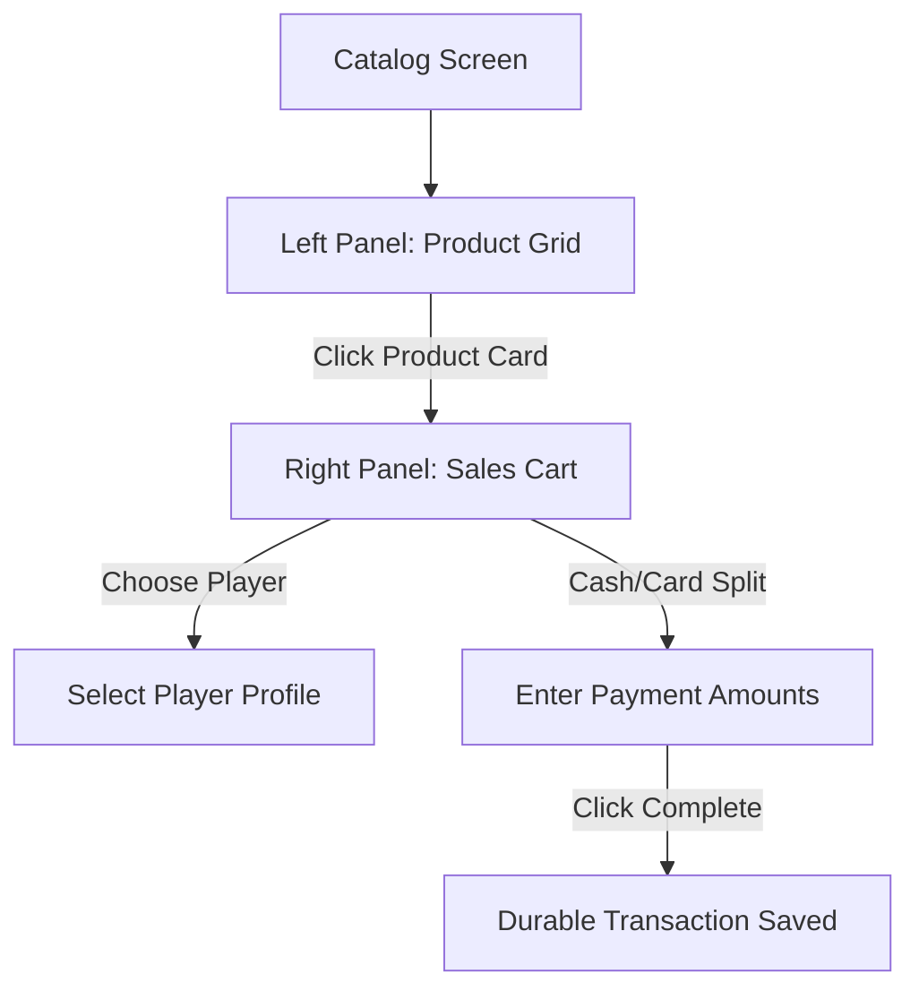

# Feature Spec 09: Product Sales

## Purpose
The Product Sales system handles concessions, gear, and accessory sales (e.g., brand-required grippy socks, bottled water, juices). The cashier must be able to ring up sales quickly either as anonymous cash/card transactions or by linking them to specific player profiles (e.g., to record a sale on credit). It enforces financial audit integrity by capturing snapshots of pricing and naming at the exact moment of sale.

---

## Build Notes
- **Language & Runtime**: Dart & Flutter (Windows desktop layout).
- **State Management**: Riverpod (`StateNotifierProvider` or `NotifierProvider`).
- **Database & Persistence**: Drift with SQLite.
- **Folder Structure**:
  - `lib/features/products/presentation/` (Widgets: `product_grid.dart`, `cart_summary.dart`, ViewModels: `product_sales_notifier.dart`)
  - `lib/data/repositories/product_repository.dart`
  - `lib/domain/services/checkout_service.dart` (integrates product sales into checkout routines)

---

## Data/Domain/Storage
This feature relies on the `products`, `product_sales`, and `sale_items` tables.

Refer directly to:
- [`context/schema-reference.md#6-products`](../schema-reference.md#6-products) for the `products` table.
- [`context/schema-reference.md#7-product_sales`](../schema-reference.md#7-product_sales) for the `product_sales` table.
- [`context/schema-reference.md#8-sale_items`](../schema-reference.md#8-sale_items) for the `sale_items` table.

### Snapshot Mechanics
To maintain immutable historical financial records, the `sale_items` table stores:
- `product_name_snapshot`: The name of the product at checkout time.
- `unit_price_snapshot`: The unit price in SYP at checkout time.

If a manager edits a product's name (e.g., from "Grippy Socks Blue" to "Elite Grippy Socks Blue") or changes the price from `12,000 SYP` to `15,000 SYP`, all historic sales records must continue to reflect the original values at checkout time. Recalculations are strictly derived from these snapshots, never live catalog joins.

---

## UI and Workflow

### Layout Context
This interface operates within the **Persistent Split-Panel Layout** (Left Panel ~60% Active Board / Catalog, Right Panel ~40% Context & Action Panel). Clicking "Product Catalog" on the navigation rail changes the Left Panel to show a grid of catalog products.

### 1. Product Grid (Left Panel)
- Displays active catalog items inside a high-density grid.
- Each card shows:
  - Product Name (localized key)
  - SKU
  - Price in SYP (e.g., `12,000 SYP`)
  - Current Stock count (with calm orange text if stock is below the minimum threshold, or red if negative)
- Clicking a card triggers the `addToCart` provider, appending it to the cart list in the Right Panel.

### 2. Sales Cart & Checkout (Right Panel)
- **Cart List**: Compact vertical list of added products.
  - Shows name, SKU, price, quantity selector (`-` `Qty` `+` buttons), and total cost.
- **Player Link Selector**:
  - Default state: `"Anonymous Sale"`.
  - Toggle or Search icon opens a popover to search and select an existing player.
  - If a player is linked, shows their name and active debt warnings.
- **Payment Interface**:
  - Displays total charge in SYP with thousands separator.
  - Cash payment input field (`inputCashAmount`).
  - Card payment input field (`inputCardAmount`).
  - Automatically calculates changes due or outstanding debt based on inputs.
- **Form Actions**:
  - Button `btnCompleteSale` ("Complete Sale") with Modern Cashier Calm brand yellow `#FBF306` background. Validates transaction rules.
  - Button `btnClearCart` ("Clear Cart") to reset inputs.

---

## Edge Cases and Rules

| Rule ID | Operational Scenario | Business Constraint | Action / Enforcement |
| :--- | :--- | :--- | :--- |
| **PS-01** | Price alteration | Product price changes after sale has completed. | Historical sales remain unaffected due to snapshotting in `sale_items`. |
| **PS-02** | Per-sale editing | Cashier attempts to edit the product price during checkout. | **Forbidden**. Per-sale custom price adjustments are blocked. Prices are strictly catalog-derived. |
| **PS-03** | Anonymous Debt | Cashier attempts to save an unpaid sale as anonymous. | **Forbidden**. Anonymous debt is not allowed. Sales without a linked `player_id` must have payments satisfying: `cash + card >= total_charge`. |
| **PS-04** | Inventory decrement | A sale is completed. | System automatically logs negative stock movements of type `'sale'` for all items in the transaction. |
| **PS-05** | Sale Voiding | Cashier voids a completed sale. | Requires **Admin Password**. Flipping a sale status to `'voided'` triggers a reversing audit event, creates compensating positive inventory movements of type `'void'`, and logs a `corrections` row. |
| **PS-06** | Credit Payment | A registered player with active debt purchases products. | Outstanding debt warning is displayed. Cashier can append underpayments to player's debt ledger (`debts` table) only if a player profile is linked. |

---

## Tests and Verification

### Unit & Domain Service Tests
- **Anonymous Sale Payment Constraints**:
  - Assert that an anonymous checkout throws a `PaymentMismatchException` if payment total is less than the cart total.
  - Assert that an anonymous checkout with overpayment successfully completes and returns the exact change value.
- **Linked Player Checkout Debt Allocation**:
  - Test checkout calculations for a registered player paying partially. Ensure that cart total = 25,000 SYP, payment = 15,000 SYP, results in `debt_amount = 10,000 SYP` allocated to the player. Verify no debt is recorded if fully paid.
- **Discount Exclusions**:
  - Verify that a flat employee discount cannot reduce a product sale total unless a dedicated catalog-level discount rule is explicitly applied (out of scope for general discounts).

### Repository & Integration Tests
- **Snapshot Assertions**:
  - Create a catalog product "Water" priced at 2,000 SYP. Complete a sale of 2 units.
  - Programmatically update the product catalog price of "Water" to 3,000 SYP.
  - Query the database record in `sale_items` for the completed transaction. Assert that `unit_price_snapshot` remains exactly `2,000` and `product_name_snapshot` is `"Water"`.
- **Inventory Ledger Sync**:
  - Assert that completing a product sale with quantity 3 decrements the product's `current_stock` by exactly 3, and inserts a row in `inventory_movements` with `quantity_change = -3`, `movement_type = 'sale'`, and matching `associated_sale_id`.

### Presentation / Widget Tests
- **Cart Functionality**:
  - Tap a product card in the grid. Verify that the Cart Summary displays 1 item.
  - Increment quantity using the "+" button in the Right Panel. Assert that the cart totals update dynamically in real time.
  - Verify that clicking "Complete Sale" when anonymous and inputs are empty displays an inline error warning about payment requirements.

---

## Acceptance Checklist

- [ ] SQLite tables `products`, `product_sales`, and `sale_items` are created and matches `schema-reference.md`.
- [ ] Product grid displays real-time inventory counts and alerts cashiers when stock levels are low or negative.
- [ ] "Anonymous Sale" is the default cart state and enforces exact or overpaid cash/card entries.
- [ ] Linking a player is required to assign outstanding product balances to a player's debt history.
- [ ] Sale transactions write matching `sale_items` snapshots, decrement catalog stock levels, and write ledger logs.
- [ ] Voiding a sale triggers a password-protected admin correction, reversing inventory stock counts via a ledger correction movement.
- [ ] User-facing text matches localization keys (e.g., `btnCompleteSale`, `inputCashAmount`, `labelAnonymous`).
- [ ] Domain checkout calculation logic is fully tested and independent of Flutter layouts.

---

## What success looks like
An anonymous customer walks up and orders two blue trampoline grippy socks. The cashier taps "Grippy Socks Blue" twice on the left-panel grid. The right-panel cart summary displays a total of `24,000 SYP`. The cashier keys in `25,000 SYP` in the cash field. The screen immediately calculates and displays `1,000 SYP` change due. Clicking "Complete Sale" saves the transaction, logs a negative stock movement for two pairs of socks, and resets the cart, leaving the cashier ready for the next customer.
