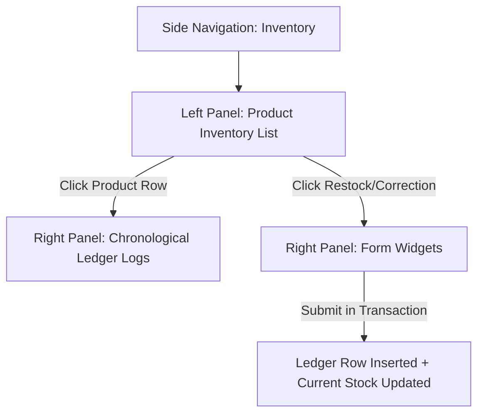

# Feature Spec 10: Inventory

## Purpose
The Inventory system tracks and audits all physical stock (e.g., socks, refreshments) in the park. To ensure strict financial accountability and theft prevention, stock changes can *only* occur via logged ledger movements. This design accommodates operational realities (like selling items before a restock sheet is entered) by allowing negative stock levels, while flagging warnings clearly for cashier adjustments.

---

## Build Notes
- **Language & Runtime**: Dart & Flutter (Windows desktop layout).
- **State Management**: Riverpod (`NotifierProvider` or `StateNotifierProvider`).
- **Database & Persistence**: Drift with SQLite.
- **Folder Structure**:
  - `lib/features/inventory/presentation/` (Widgets: `inventory_screen.dart`, `restock_dialog.dart`, `correction_dialog.dart`, ViewModels: `inventory_notifier.dart`)
  - `lib/data/repositories/inventory_repository.dart`
  - `lib/domain/services/inventory_service.dart` (owns stock ledger logic)

---

## Data/Domain/Storage
This feature relies on the `products` and `inventory_movements` tables.

Refer directly to:
- [`context/schema-reference.md#6-products`](../schema-reference.md#6-products) for the `products` table.
- [`context/schema-reference.md#12-inventory_movements`](../schema-reference.md#12-inventory_movements) for the `inventory_movements` table.

### Ledger Audit Integrity Invariants
- **No Direct Mutations**: The catalog `products.current_stock` column must never be updated directly via raw SQLite setters. All changes must go through a repository transaction that writes an `inventory_movements` row and updates `products.current_stock` simultaneously.
- **Audit Sequence**: Every ledger row captures `stock_before` and `stock_after` to guarantee a complete traceable sequence of inventory history.

---

## UI and Workflow

### Layout Context
This interface operates within the **Persistent Split-Panel Layout** (Left Panel ~60% Inventory Table, Right Panel ~40% Ledger & Movement Form). Clicking the Side Navigation rail for **Inventory** launches this interface.

### 1. Product Inventory Table (Left Panel)
- **High-Density Table**: Columns displaying:
  - SKU
  - Product Name (localized key)
  - Current Stock
  - Stock Status Badge:
    - Green `"In Stock"`: Stock is above 10 units.
    - Calm Orange `"Low Stock"`: Stock is between 1 and 10 units.
    - Neutral Grey `"Out of Stock"`: Stock is exactly 0.
    - Calm Red `"Negative Stock"`: Stock is below 0 (indicates inventory tally mismatch).
  - Actions (Buttons to "Restock" or "Correct Stock")

### 2. Chronological Ledger Logs (Right Panel - Default View)
- Displays a scrollable, paginated audit list of `inventory_movements` for the selected product:
  - Date & Time (formatted to Damascus local timezone)
  - Movement Type badge (`'restock'`, `'sale'`, `'correction'`, `'void'`)
  - Quantity Change indicator (e.g., `+50` in green, `-2` in dark text)
  - Resulting Stock (`[X] -> [Y]`)
  - Notes / Operator reason

### 3. Restock & Correction Forms (Right Panel - Action View)
- Clicking "Restock" or "Correct" loads the form in the Right Panel:
  - **Quantity Input**: Positive integers only for restocks; positive/negative integers for corrections.
  - **Notes / Reason Field**: A mandatory text field to explain the entry (e.g. `"Initial delivery delivery-02"`, `"Found 2 damaged bottles on shelf"`).
  - **Form Actions**:
    - Button `btnSubmitMovement` ("Save Movement") styled with brand yellow `#FBF306`.
    - Button `btnCancel` to go back to ledger.

---

## Edge Cases and Rules

| Rule ID | Operational Scenario | Business Constraint | Action / Enforcement |
| :--- | :--- | :--- | :--- |
| **IV-01** | Negative Stock | A sale is recorded but physical count is out-of-sync, driving stock below zero. | **Allowed**. Sales must never be blocked by software tallies. Stock goes negative, and the UI highlights it in red as a warning to trigger manual audits. |
| **IV-02** | Sale Voiding | An administrator voids a product sale. | The checkout service triggers a compensating positive inventory movement of type `'void'` for all items in the sale, restoring stock levels. |
| **IV-03** | Concurrent Mutex | Multiple transactions attempt to modify the stock of a product simultaneously. | All updates occur in a SQLite database transaction. The repository locks the row during update to prevent race conditions on `stock_before` / `stock_after` calculation. |
| **IV-04** | Soft Deactivation | A product is deactivated via soft-delete in the catalog settings. | The product is hidden from sales catalog screens, but remains visible in the historical Inventory screen to maintain old movement logs. |

---

## Tests and Verification

### Unit & Domain Service Tests
- **Stock Calculations**:
  - Assert that applying a movement of type `'restock'` with `change = 50` on a product with current stock `10` updates stock to `60`.
  - Assert that applying a movement of type `'sale'` with `change = -5` on stock `2` yields `-3` stock and triggers no application crash.
- **Mandatory Notes Check**:
  - Verify that executing a correction movement with empty notes fails validation.

### Repository & Integration Tests
- **Durable Audit Sync**:
  - Begin transaction. Insert a movement of `+20` for product A. Retrieve product A in same transaction, verify `current_stock = 20`. Commit transaction. Assert both row creation and stock update are durable.
- **Concurrent Thread Safety**:
  - Run 10 parallel asynchronous workers checking out 1 item each of Product B (initial stock = 100). Verify final stock is exactly `90` and `inventory_movements` contains exactly 10 matching sequence rows with valid incremental `stock_before` and `stock_after` states.

### Presentation / Widget Tests
- **Stock Status Badge Selection**:
  - Feed a mock view model with products containing stock levels `12`, `5`, `0`, and `-2`.
  - Verify UI renders a Green, Orange, Grey, and Red status badge respectively.
- **Restock Validation Rules**:
  - Open Restock form, enter `0` or negative values. Verify the "Save" button is disabled and displays an inline error message.

---

## Acceptance Checklist

- [ ] SQLite tables `products` and `inventory_movements` are implemented according to `schema-reference.md`.
- [ ] Direct updates to `products.current_stock` are blocked; mutations must invoke `InventoryService` transactions.
- [ ] Negative stock levels are permitted, and are styled with a red status badge to warn cashiers.
- [ ] Product sale voids automatically insert positive corrective movements linked to the `associated_sale_id`.
- [ ] Chronological movements list is paginated and renders timestamps in `Asia/Damascus` local timezone.
- [ ] Standard button and text labels follow localization standard keys (`btnSubmitMovement`).
- [ ] Unit tests cover inventory transactions and concurrent execution.

---

## What success looks like
The cashier loads the Inventory screen. In the Left Panel, "Bottled Water" shows `current_stock = -3` with a red warning badge. Recognizing a counting mismatch, the cashier clicks "Correct Stock". In the Right Panel, they enter `3` (to reflect a manual shelf count of 0) and type "Shelf count audit - corrected missing stock records". Tapping "Save" inserts a `'correction'` ledger movement log with `stock_before = -3` and `stock_after = 0`, resolving the red warning immediately while leaving an immutable audit trail.
