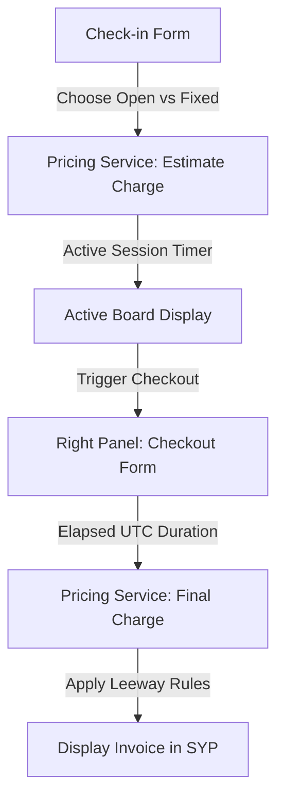

# Feature Spec 11: Time Pricing

## Purpose
The Pricing Matrix Service represents the financial core of the trampoline park's play session system. Play sessions are structured either as pre-booked **Fixed Duration** blocks or uncapped **Open Time** accruals. This specification defines a transaction-safe, integer-only pricing engine that calculates session charges dynamically, factoring in a configurable 10-minute leeway grace period to prevent cashier disputes during exit checkouts.

---

## Build Notes
- **Language & Runtime**: Pure Dart domain layer. Strict separation from Flutter/UI components ensures easy testing.
- **State Management**: Riverpod for providing the stateless pricing service and caching settings matrices.
- **Folder Structure**:
  - `lib/domain/services/pricing_service.dart` (owns mathematical billing logic)
  - `lib/domain/models/pricing_matrix.dart` (defines price blocks and rates models)
  - `test/domain/pricing_service_test.dart` (exhaustive pricing tests)

---

## Data/Domain/Storage
This feature queries configuration settings from `system_settings` and calculates checkout values for insertion into the `sessions` table.

Refer directly to:
- [`context/schema-reference.md#3-sessions`](../schema-reference.md#3-sessions) for session records.
- [`context/schema-reference.md#16-system_settings`](../schema-reference.md#16-system_settings) for leeway configuration storage.

### Data Validation Invariants
- **No Floating-Point Math**: Currency is strictly stored and calculated as integer **SYP** (Syrian Pounds). Double types for currency are strictly forbidden.
- **Duration Units**: All elapsed duration math is performed as integer minutes derived from UTC timestamps.

---

## UI and Workflow

### Layout Context
While the pricing matrix runs entirely as a background domain service, cashiers interact with its calculations on the Active Board (Left Panel) and checkout forms (Right Panel). Managers configure the pricing table within the Settings rail.

### Cashier Billing Workflows
1. **Fixed Duration Check-In**:
   - The cashier selects **Fixed Duration** and clicks `+` or `-` buttons to choose duration blocks (e.g., `30`, `60`, `90`, `120` minutes).
   - The system displays the estimated block price immediately on the form using the Fixed rate matrix.
2. **Open Time Check-In**:
   - The cashier selects **Open Time**. The starting charge estimation is shown as `0 SYP`.
   - While on the Active Board, the session tracks elapsed time. The screen shows dynamic billing estimations based on active elapsed minutes.
3. **Checkout Calculation**:
   - Tapping "Checkout" in the Left Panel stops the active session timer, records the current UTC timestamp, and invokes `PricingService.calculateCharge`. The result displays on the right checkout panel.

---

## Edge Cases and Rules

### 1. Unified Billing Matrix Table (SYP)
The following baseline pricing structure is enforced for all check-in calculations:

| Duration Block | Fixed Duration Cost (SYP) | Open Time Cost (SYP) | Incremental Delta (SYP) |
| :--- | :--- | :--- | :--- |
| **30 Minutes** | 10,000 SYP | 12,000 SYP | Baseline Block 1 |
| **60 Minutes** | 18,000 SYP | 20,000 SYP | +8,000 SYP (Fixed) / +8,000 SYP (Open) |
| **90 Minutes** | 25,000 SYP | 27,000 SYP | +7,000 SYP (Fixed) / +7,000 SYP (Open) |
| **120 Minutes** | 32,000 SYP | 34,000 SYP | +7,000 SYP (Fixed) / +7,000 SYP (Open) |
| **Subsequent Blocks** | Base (32k) + 7k per 30 mins | Base (34k) + 8k per 30 mins | Subsequent 30-min block increments |

### 2. Leeway Grace Period Logic
- **Configuration Key**: `'leeway_minutes'` (default is `10` minutes, stored in SQLite `system_settings`).
- **Fixed Duration Grace Rule**: If a player checks in for a `60-minute` block and plays for `70` minutes, they are charged for exactly `60` minutes (`18,000 SYP`). If they stay `71` minutes, they have exceeded the 10-minute leeway. They are charged for the next full 30-minute block (`90 minutes` total = `25,000 SYP`).
- **Open Time Grace Rule**: Open Time charges accrue in 30-minute increments. A player playing for `40` minutes pays for one 30-minute block (`12,000 SYP`). Playing for `41` minutes triggers the second 30-minute block charge (`20,000 SYP` total).

### 3. Chronological Rules
- Timestamps are stored as UTC ISO-8601 strings.
- Total elapsed minutes are computed as: `checkout_at.difference(check_in_at).inMinutes`. This represents real physical elapsed time, completely immune to local timezone changes or daylight saving adjustments.

---

## Tests and Verification

All pricing rules are verified through high-density unit tests in `test/domain/pricing_service_test.dart` to guarantee financial correctness.

### Target Unit Test Scenarios

#### Scenario 1: Fixed Duration Calculation
- Input: `reservedBlocks = 2` (60 minutes).
- Assertions:
  - Elapsed duration = `60 minutes` -> Charge = `18,000 SYP`.
  - Elapsed duration = `69 minutes` (within leeway) -> Charge = `18,000 SYP`.
  - Elapsed duration = `70 minutes` (exactly at leeway boundary) -> Charge = `18,000 SYP`.
  - Elapsed duration = `71 minutes` (leeway exceeded) -> Charge = `25,000 SYP` (price of 90-minute block).
  - Elapsed duration = `100 minutes` (exceeded 90-min block + leeway) -> Charge = `32,000 SYP` (price of 120-minute block).

#### Scenario 2: Open Time Calculation
- Input: `entryType = 'open'`.
- Assertions:
  - Elapsed duration = `25 minutes` -> Charge = `12,000 SYP` (minimum 30-minute charge block).
  - Elapsed duration = `30 minutes` -> Charge = `12,000 SYP`.
  - Elapsed duration = `40 minutes` (within leeway) -> Charge = `12,000 SYP`.
  - Elapsed duration = `41 minutes` (leeway exceeded) -> Charge = `20,000 SYP` (price of 60-minute block).
  - Elapsed duration = `70 minutes` -> Charge = `20,000 SYP`.
  - Elapsed duration = `71 minutes` -> Charge = `27,000 SYP` (price of 90-minute block).

#### Scenario 3: Large Durations Calculation
- Input: `reservedBlocks = 4` (120 minutes), playing for 180 minutes.
- Assertions:
  - Elapsed duration = `180 minutes` -> Charge = `32,000 SYP` (120 mins) + 2 blocks * `7,000 SYP` = `46,000 SYP`.
- Input: `entryType = 'open'`, playing for 180 minutes.
- Assertions:
  - Elapsed duration = `180 minutes` -> Charge = `34,000 SYP` (120 mins) + 2 blocks * `8,000 SYP` = `50,000 SYP`.

---

## Acceptance Checklist

- [ ] SQLite schema `sessions` matches structure, storing calculated charges as integers in SYP.
- [ ] Leeway setting `'leeway_minutes'` is loaded dynamically from settings repository, defaulting to `10` minutes if not configured.
- [ ] Fixed Duration check-in rounds overtime exceeding leeway to the next full 30-minute block cost.
- [ ] Open Time check-in charges in 30-minute blocks, applying leeway at each block transition boundary.
- [ ] Elapsed play time math uses UTC timestamps, preventing daylight saving or business timezone hour offsets from distorting play duration.
- [ ] Currency calculations are completely covered by pure Dart unit tests, with zero float division logic.
- [ ] App settings page allows editing leeway minutes and rate configurations with instant recalculations on subsequent checkouts.

---

## What success looks like
A cashier checks out a player who was booked for a 60-minute Fixed Duration session. The checkout panel loads and shows that the player checked in at `14:00` and checked out at `15:10` (elapsed time = 70 minutes). Because of the 10-minute leeway, the calculated charge is displayed as exactly `18,000 SYP` (no extra charge). Another player checking out at `15:11` (elapsed time = 71 minutes) is automatically billed `25,000 SYP`, with the screen showing a breakdown detailing `90 mins billed` due to exceeding the leeway threshold.
