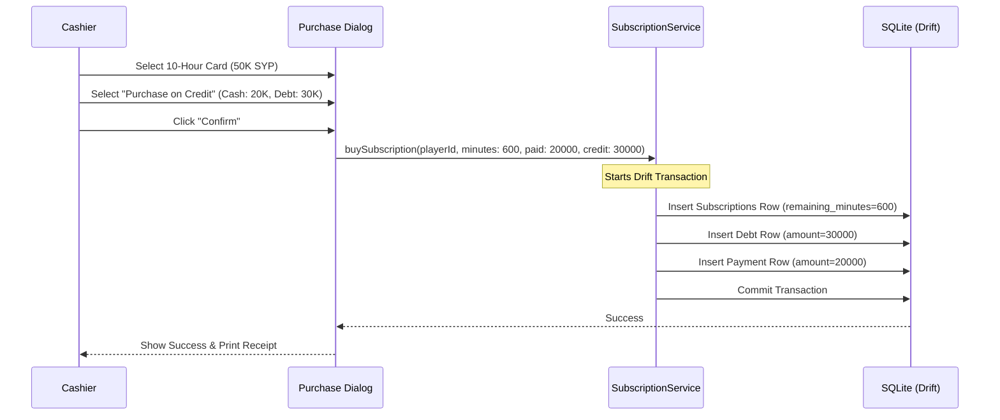

# Feature Spec 12: Subscriptions

## Purpose
Enable players to buy multi-hour prepaid bundles (e.g., 10-hour cards) that are dynamically auto-detected at check-in. The system must accurately track remaining minutes, record detailed usage audit trails, enforce strict calendar-month expirations, and support buying subscriptions on credit (creating outstanding player debt linked to the purchase).

---

## Build Notes
- **Language & Runtime**: Dart, Flutter Desktop for Windows (Material 3).
- **State Management**: Riverpod.
- **Database Access**: Drift (using transactional queries for purchasing, checkout consumption, and voiding).
- **Folder Structure**:
  - `lib/features/subscriptions/presentation/widgets/subscription_purchase_dialog.dart` (Purchase form)
  - `lib/features/subscriptions/presentation/widgets/subscription_card.dart` (Visual card for player profile view)
  - `lib/features/subscriptions/presentation/widgets/subscription_usage_list.dart` (Usage log table)
  - `lib/domain/services/subscription_service.dart` (Domain service containing purchase, decrement, and expiry calculation logic)

---

## Data/Domain/Storage
Subscriptions and their usage tracking are persisted in SQLite.
Refer to [schema-reference.md](../schema-reference.md) for the exact schema details of the following tables:
- **`subscriptions`**: The parent record capturing purchase time, duration, status, and unpaid debt mapping.
- **`subscription_usage_logs`**: The audit trail mapping consumption of minutes back to checked-in sessions.
- **`debts`**: Outstanding credit records generated if the subscription was bought on credit.
- **`payments`**: Standard financial logs if the subscription was paid fully or partially in cash/card.

### Domain Invariants & Calculation Rules
1. **Deduction Granularity**:
   - Subscriptions are consumed in strictly **30-minute blocks**.
   - If a player checks in under a subscription and checks out after 45 minutes, they consume exactly **60 minutes** (2 blocks). The calculation rounds *up* to the nearest 30-minute boundary once the leeway period is crossed.
2. **Expiration Calculation**:
   - The expiration date (`expires_at`) is exactly **one calendar month** from the purchase date (`purchased_at`) at `23:59:59` in the `Asia/Damascus` business timezone.
   - Example: A card purchased on May 22, 2026, expires on June 22, 2026, at `23:59:59` local time. If purchased on January 31, it expires on February 28 (or 29 in leap years).
3. **Credit Purchases (Unpaid Subscriptions)**:
   - Customers can purchase a subscription without immediate full payment.
   - If the payment amount at purchase is less than the subscription cost, the remaining balance is written as a new `debts` record (`status = 'active'`).
   - The subscription's `unpaid_debt_id` field is populated with the UUID of the newly created `debts` record.
   - **Key Separation Invariant**: The customer *can* immediately check in and use the subscription hours even if the subscription itself is unpaid (the hours are valid, but the player profile accumulates the financial debt).

---

## UI and Workflow

### 1. Purchase Workflow
1. **Initiation**: In the player profile page (Context Panel), the cashier clicks **"Buy Subscription"** (`btnBuySubscription`).
2. **Options**: A dialog opens offering configured card options (e.g., 5-Hour Card, 10-Hour Card, 20-Hour Card).
3. **Payment Section**:
   - Displays total price (e.g., 50,000 SYP).
   - Allows split payment entry (Cash/Card fields).
   - **"Purchase on Credit" checkbox**: If checked, enables the cashier to submit the purchase with a partial or zero payment, assigning the remainder as player debt.
4. **Validation**: The form verifies that either a payment is entered, or the credit checkbox is checked, and that the player has a primary phone number configured.
5. **Confirmation**: Clicking **"Purchase Card"** (`btnPurchaseCard`) triggers a Drift transaction that inserts the `subscriptions` record, updates `players` profile cache, inserts any `payments` or `debts` entries, and prints a subscription purchase receipt.

### 2. Subscription Usage and History UI
Within the Player Profile view in the Context Panel, a dedicated **Subscriptions** tab is provided:
- **Active Subscription Widget**:
  - Displays remaining hours/minutes graphically via a circular progress indicator (Brand yellow `#FBF306` track).
  - Displays the card UUID, purchase date, and exact expiration countdown.
  - Links directly to any outstanding debt (`unpaid_debt_id`) with a warning badge.
- **Audit Logs Table**:
  - Lists every check-in session that consumed minutes from this card.
  - Columns: Date & Time, Session ID, Blocks Consumed, Remaining Balance After, Cashier Name/ID.

### 3. Check-In & Auto-Detection Workflow
- When a cashier starts a check-in for a player:
  - If a valid subscription is found in `subscriptions` table (`remaining_minutes > 0` AND `expires_at > current_time` AND `status = 'active'`), the system automatically pre-selects the subscription as the payment vehicle.
  - The check-in form displays: "Active Subscription Selected: 480 mins left".
  - Bypasses traditional ticket rates, locking check-in options to Fixed Duration up to the remaining minutes limit.

---

## Edge Cases and Rules
1. **Subscription Expiration**:
   - If a subscription expires *while* a player is inside the park, the active session is allowed to complete. The checkout service will consume the remaining minutes down to `0`. Any overtime minutes beyond the remaining subscription balance are calculated at the standard cash ticket rate and billed during checkout.
2. **Double Consumption Guard**:
   - When checking in a group of players, a subscription belongs *only* to its registered `player_id`. Subscriptions cannot be shared or used to check in other players in a group session.
3. **Voiding a Subscription**:
   - If a cashier sells a subscription in error, they can void it via the Corrections module (requires admin password).
   - Voiding a subscription deletes the active minutes, voids the associated outstanding debt (if unpaid), and flags the record status as `'voided'`. Any sessions that consumed minutes from this subscription before the void must be recalculated at standard ticket rates.

---

## Tests and Verification

### Unit Tests (`test/domain/subscription_service_test.dart`)
- **Calendar Expiry Calculation**: Assert that buying a card on February 28, 2024 (Leap year) sets the expiration precisely to March 28, 2024, at `23:59:59` Damascus time.
- **Credit Purchase Ledger Entry**: Verify that buying a 100,000 SYP subscription with a payment of 40,000 SYP correctly writes a payments record of 40,000 SYP and an active debt record of 60,000 SYP, linking their IDs.
- **Block Round-Up Logic**: Verify that a session of 31 minutes consumes exactly 60 minutes (2 blocks) of subscription time, while a 29-minute session consumes 30 minutes (1 block), assuming no leeway settings.

### Widget Tests (`test/features/subscriptions/subscription_purchase_widget_test.dart`)
- **Debt Checkbox Interactivity**: Check the "Purchase on Credit" checkbox, assert that the "Cash Paid" field allows 0, and verify that the checkout validation error is cleared.
- **Remaining Minutes Progress Bar**: Provide a mock subscription with 240 minutes left out of 600, render the card widget, and assert that the text "4 Hours Left (40%)" is visible.

---

## Acceptance Checklist

| ID | Requirement Details | Check |
| --- | --- | --- |
| AC-12.1 | Verify that the purchase dialog loads properly and displays card options. | [ ] |
| AC-12.2 | Verify that purchasing on credit creates a debt record linked to the subscription. | [ ] |
| AC-12.3 | Verify that expirations are set exactly to one calendar month local time. | [ ] |
| AC-12.4 | Verify that a player's subscription is auto-detected and selected during check-in. | [ ] |
| AC-12.5 | Verify that checking out a subscription session logs the exact blocks consumed. | [ ] |
| AC-12.6 | Verify that subscription details and circular progress bar display on the player profile. | [ ] |
| AC-12.7 | Verify that an expired subscription is ignored by the check-in auto-detection logic. | [ ] |

---

## What success looks like
Regular jumpers purchase subscription packages at the desk in a few clicks. The player's profile instantly displays a progress bar showing their pre-purchased hours. When they arrive at the park, the cashier simply scans their card or enters their name: the system instantly flags their active subscription, sets up their session, and checks them in. At checkout, the system automatically subtracts the elapsed 30-minute intervals from their balance and logs a solid audit record, all without any mathematical efforts from the cashier.
