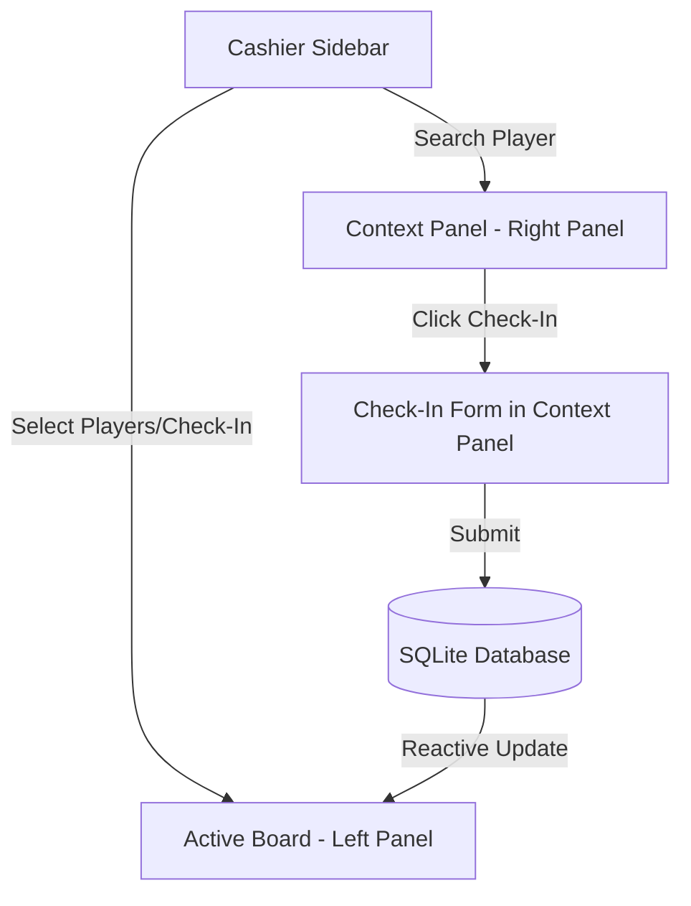

# Feature Spec 13: Check-in and Active Sessions

## Purpose
Provide a high-throughput, reliable check-in experience and a real-time "Active Board" for cashiers at the trampoline park. The cashier must be able to quickly select or search for a player, configure their duration (Open Time vs. Fixed Duration), auto-detect valid subscriptions, check them in, and track their remaining session time dynamically. The Active Board serves as the persistent left panel of the split-pane cashier desk layout, showing real-time timers and triggering visual/auditory alarms when play sessions expire (overdue).

---

## Build Notes
- **Language & Runtime**: Dart, Flutter Desktop for Windows (Material 3).
- **State Management**: Riverpod (with `StateNotifier` or the new `@riverpod` annotations using `Notifier` / `AsyncNotifier`).
- **Database Access**: Drift (using a reactive query stream on the `sessions` and `players` tables).
- **Auditory Alerts**: Windows-compatible sound playback using a lightweight, native-compatible package (e.g., `audioplayers` or custom Win32 audio bindings) with fallback to standard system beep.
- **Folder Structure**:
  - `lib/features/sessions/presentation/widgets/active_board.dart` (Active Board split panel)
  - `lib/features/sessions/presentation/widgets/check_in_form.dart` (Check-in view in right context panel)
  - `lib/features/sessions/presentation/active_sessions_notifier.dart` (Notifier managing active list)
  - `lib/features/sessions/presentation/timer_tick_provider.dart` (Riverpod stream/ticker for UI updates)
  - `lib/features/sessions/presentation/audio_alert_service.dart` (Auditory player & mute status controller)
  - `lib/domain/services/session_service.dart` (Pure business rules for check-in creation and duration logic)

---

## Data/Domain/Storage
Active sessions are stored in the local SQLite database in the `sessions` table.
Refer to [schema-reference.md](../schema-reference.md) for the exact schema details of the following tables:
- **`players`**: To read profile info and check `has_active_session`.
- **`sessions`**: To write and read session details (`entry_type`, `reserved_blocks`, `check_in_at`, `status`, `subscription_id`).
- **`subscriptions`**: To auto-detect and validate outstanding subscription contracts.
- **`subscription_usage_logs`**: To log block decrements upon check-in.
- **`system_settings`**: To read leeway thresholds (`'leeway_minutes'`, `'stale_threshold_minutes'`).

### Domain Model Invariants & Rules
1. **Entry Types**:
   - `open`: Infinite play session. Billed dynamically upon checkout based on total elapsed minutes.
   - `fixed`: Prepaid or pre-selected block duration. Configured in multiples of 30 minutes (1 block = 30 mins).
2. **Subscription Constraint**:
   - If a player holds a valid, unexpired subscription with remaining minutes, they **must** enter using their subscription. The UI automatically enforces this entry type and locks the check-in to fixed blocks matching their remaining balance (or standard cashier options deducted from the card).
3. **Double Check-In Guard**:
   - A player cannot be checked in if `players.has_active_session` is `1` (true). The system prevents launching the check-in screen for such players.

---

## UI and Workflow

### 1. Split-Panel Context
The application uses the **Persistent Split-Panel Layout** (1080p target):
- **Left Panel (~60% width)**: Active Board. Always visible. Lists running sessions, visual alert badges, and active countdowns.
- **Right Panel (~40% width)**: Context Panel. Dynamically displays the Check-In form when a player is selected for check-in.

### 2. Check-In Flow
1. **Initiation**: Cashier searches for a player in the Players registry or clicks a shortcut. When a player is selected, their profile card opens in the Context Panel with a prominent yellow **"Check In"** button (`btnCheckIn`).
2. **Auto-Detection of Subscriptions**:
   - The check-in form loads and queries the `subscriptions` table for active, unexpired cards associated with `player_id`.
   - If an active subscription is found, the UI displays a badge: `chipSubscription` ("Subscription Active: X hrs Y mins remaining").
   - The entry type selector is locked to "Subscription" and normal "Open/Fixed Cash" controls are disabled.
3. **Session Duration Setup (Non-Subscription)**:
   - Cashier selects **Fixed Duration** or **Open Time**.
   - For **Fixed Duration**, a number spinner/selector is shown with a text field showing total hours/minutes, flanked by `-` and `+` buttons. Clicking changes duration by 30-minute intervals (e.g., 30m, 60m, 90m, 120m). Default is 60 minutes.
   - For **Open Time**, the spinner is hidden, and the screen displays an information badge explaining that billing will accumulate dynamically.
4. **Submit**: Cashier clicks **"Confirm Check-In"** (`btnConfirmCheckIn`). The check-in is persisted in `sessions`, `players.has_active_session` is set to `1` (true), and the Right Panel clears or returns to the player's dashboard.

### 3. Active Board UI Layout
A dense grid/list showing active players:
- **Header**: Includes active player count, search box, and a **Global Mute** toggle button (`btnGlobalMute`) for overdue alarms.
- **Session Card**:
  - **Player Name & Phone**: Primary identifiers.
  - **Status Chips**:
    - `chipOpenTime` (Blue-gray) for Open Time sessions.
    - `chipFixedDuration` (Light blue) showing target remaining time (e.g., "42m remaining").
    - `chipSubscription` (Gold/Green text) indicating a subscription session.
  - **Real-Time Timer**:
    - Displays format: `HH:MM:SS` (elapsed for Open Time, counting down for Fixed Duration).
    - Refreshes every second.
  - **Actions Container**: Quick access to "Checkout" or "Void Session".

### 4. Overdue Alerts & Auditory Alarms
When a Fixed Duration session's timer crosses `00:00:00` (accounting for the configured grace/leeway period from `system_settings` `'leeway_minutes'`):
- **Visual Alert**: The session card background changes to soft alerting red, the timer flashes negative values (e.g., `-00:04:12`), and a high-visibility badge `chipOverdue` is rendered.
- **Auditory Alert**:
  - A short alarm sound (beep or bell) is played.
  - **Alert Frequency**: Played exactly **once** upon transitioning to the overdue state to prevent cashier fatigue.
  - **Snooze/Mute**: Individual snooze buttons (`btnSnoozeAlert`) on the card mute the audio reminder and dismiss the visual flashing for 10 minutes. A global mute toggle in the board header completely silences all audio alerts for the current cashier shift.

---

## Edge Cases and Rules
1. **Incomplete Profiles**: A player must have at least one valid phone number in `player_phones` to check in. If none exists, the check-in screen disables submission and shows a warning validation message: `msgPhoneRequired`.
2. **Auto-Expiration of Active Board Stale Sessions**:
   - If a cashier leaves a session open overnight (e.g., player never checked out), the timer will keep running.
   - Upon next-day app startup or during background checks, any session exceeding the threshold in settings (`'stale_threshold_minutes'`, default 360 minutes) is flagged as `'stale'`.
   - Stale sessions are automatically removed from the primary Active Board view and require admin-override checkout/correction before the player can check in again.
3. **Leeway Grace Period**:
   - If `'leeway_minutes'` is set to 5 minutes, a 60-minute session does not trigger overdue alarms or overtime pricing charges until 65 minutes have passed since `check_in_at`.

---

## Tests and Verification

### Unit Tests (`test/domain/session_service_test.dart`)
- **Subscription Selection Invariant**: Verify that check-in configuration throws an assertion or returns a specific validation state if a subscription holder attempts to check in via standard "Open Time".
- **Timer Formula Details**: Verify that elapsed and remaining calculations are correct across DST boundary changes in `Asia/Damascus` timezone.
- **Stale Threshold Exceeded**: Verify that a session checked in 7 hours ago is correctly marked `'stale'` by the detection utility.

### Widget Tests (`test/features/sessions/active_board_widget_test.dart`)
- **Real-Time Tick Verification**: Verify that the timer widget updates its displayed numbers every second without rebuilding the entire Active Board card container.
- **Auditory Alert Trigger**: Mock the Audio Alert Service, simulate a session transitioning into negative time, and assert that the audio play method is called exactly once.
- **Snooze Action Flow**: Tap the snooze button on an overdue card, and verify that the card visual state changes from "Alerting Flashing" to "Snoozed Alert" and silent status is active.

---

## Acceptance Checklist

| ID | Requirement Details | Check |
| --- | --- | --- |
| AC-13.1 | Verify that selecting a player opens the Check-In form in the Right Panel. | [ ] |
| AC-13.2 | Verify that the entry type selector locks to subscription if the player has remaining balance. | [ ] |
| AC-13.3 | Verify that Fixed Duration selector changes in exactly 30-minute intervals via +/- buttons. | [ ] |
| AC-13.4 | Verify that checking in a player successfully updates their status to active and spawns a card in the Left Panel. | [ ] |
| AC-13.5 | Verify that the timer ticker refreshes elapsed or countdown time every second. | [ ] |
| AC-13.6 | Verify that when a countdown hits 0 (plus leeway), the visual card turns red and play-alert triggers once. | [ ] |
| AC-13.7 | Verify that clicking "Snooze" silences the individual card alarm and delays visual flashing. | [ ] |
| AC-13.8 | Verify that the Global Mute option in the top bar silences all incoming auditory alerts. | [ ] |

---

## What success looks like
Cashiers check in regular customers in under 5 seconds. The left side of the cashier desk shows a quiet, responsive panel of active jumpers. When a jumper's time expires, the app gives a single gentle chime and colors their card in light alerting red. The cashier can immediately click "Checkout" right on the card, or hit snooze if the jumper is simply putting their shoes on. Stale sessions from yesterday are automatically swept into a safe queue on startup, preventing cluttered visual monitors.
