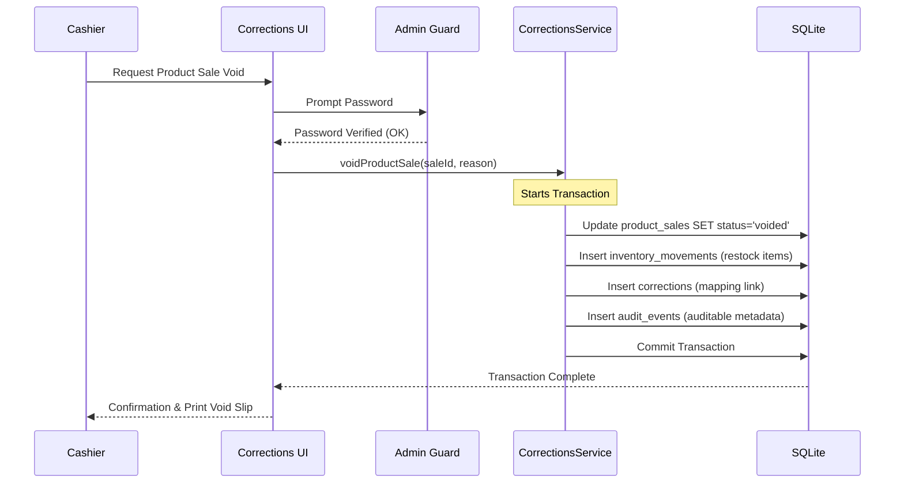

# Feature Spec 15: Corrections, Voids, and Reversals

## Purpose
Define the mechanisms for reversing business events in the application without permanently deleting records. To ensure absolute compliance with park auditing standards, the database uses **soft-delete flags**, **void statuses**, and **reversing ledger adjustments** associated with short-lived **admin authorizations** and detailed **audit log records**.

---

## Build Notes
- **Language & Runtime**: Dart, Flutter Desktop for Windows (Material 3).
- **Security & Authorization**: `lib/core/security/admin_guard.dart` (Short-lived authorization helper verifying the plaintext admin password stored in SQLite `system_settings` table).
- **State Management**: Riverpod.
- **Database Access**: Drift (using atomic multi-table transactions for reversals and inventory restock offsets).
- **Folder Structure**:
  - `lib/features/corrections/presentation/widgets/admin_password_dialog.dart` (Admin auth overlay)
  - `lib/features/corrections/presentation/widgets/corrections_log_view.dart` (Auditable corrections feed)
  - `lib/domain/services/corrections_service.dart` (Business rules defining reversals and ledger logic)
  - `lib/data/repositories/corrections_repository.dart` (Persistence logic for correction mappings)

---

## Data/Domain/Storage
Reversal actions write records to auditing tables to document the change.
Refer to [schema-reference.md](../schema-reference.md) for the exact schema details of the following tables:
- **`corrections`**: The primary link table associating the corrected row (`original_id` & `original_table`) with the correction event.
- **`audit_events`**: Detailed log capturing the admin authorization metadata, timestamps, and reason.
- **`sessions`**, `product_sales`, `subscriptions`, `debts`, `payments`: Target tables whose status column is changed to `'voided'` or whose financial figures are offset.
- **`inventory_movements`**: Written to add back stock if a product sale was voided.

### Ledger Reversal Rules & Drift Schemas
- **No Physical Deletion**: Business records are never deleted (`DELETE` statements are strictly forbidden).
- **Target Table Mutator Rules**:
  - When voiding a record (e.g. session, sale, subscription), the target row's `status` column is updated to `'voided'`.
  - A corresponding entry in the `corrections` table is generated.
  - An entry in `audit_events` is posted documenting:
    - `event_type = 'manual_void'`
    - `description = 'Voided Product Sale XYZ'`
    - `metadata = { "reason": "Accidental double-click", "cashier": "Shift_A", "admin_authenticated": true }`

---

## UI and Workflow

### 1. Admin Verification Dialog (`admin_password_dialog.dart`)
Whenever a cashier attempts a corrective or reversing action, the app prompts for an admin password override:

```text
+-------------------------------------------------------------+
|                 ADMIN AUTHORIZATION REQUIRED                |
| This action is protected. Please enter the admin password.  |
+-------------------------------------------------------------+
| [ ********** ]                                              |
|                                                             |
| Reason for correction:                                      |
| [ Customer left early / Accidental entry                v ] |
+-------------------------------------------------------------+
|               [ CANCEL ]        [ AUTHORIZE ACTION ]        |
+-------------------------------------------------------------+
```

- **Validation**: Matches input against `'admin_password'` in `system_settings`.
- **Short-Lived Authorization**: If correct, grants a temporary token (valid for 60 seconds) or immediately executes the specific transactional block and closes.

### 2. Specific Reversal Workflows

#### A. Voiding an Active Check-In
- **Trigger**: Player checked in in error (e.g., wrong player selected). Cashier clicks **"Void Session"** on the Active Board card.
- **Process**:
  - Requires admin password if the session has been active for more than 10 minutes (leeway check).
  - Updates `sessions.status = 'voided'`.
  - Sets `players.has_active_session = 0` (freeing the player).
  - Deletes dynamic timer. No financial charges are calculated.

#### B. Voiding a Completed Product Sale
- **Trigger**: Product bought in error or returned.
- **Process**:
  - Requires admin authorization.
  - Updates `product_sales.status = 'voided'`.
  - **Inventory Reversal**: The system automatically generates a positive `inventory_movements` entry (`movement_type = 'void'`) to restock the catalog items. For example, if 2 pairs of socks were sold, the reversal logs `+2` stock, restoring the inventory count.

#### C. Voiding a Subscription Purchase
- **Trigger**: Subscription card sold to the wrong customer or card was cancelled.
- **Process**:
  - Requires admin authorization.
  - The system checks if the subscription has already consumed minutes. If yes, void is blocked, and the cashier must manually adjust or handle individual sessions.
  - Updates `subscriptions.status = 'voided'`.
  - If bought on credit, the linked `debts` record is set to `'voided'`.
  - Associated payments are flagged as `'voided'` and deducted from expected cash/card calculations for the active cashier shift.

#### D. Correcting a Cashier Shift Close (Re-opening End Day)
- **Trigger**: A closed day contains incorrect counts or a cashier closed the shift prematurely.
- **Process**:
  - Re-opening a closed shift requires extreme caution and a permanent audit trail.
  - Requires the admin password.
  - The system marks the target `end_day_closes` record as `'voided'`.
  - The active cashier shift is re-opened, enabling new check-ins, product sales, and checkouts.
  - An audit log event is written containing a snapshot of the expected totals of the re-opened day.



---

## Edge Cases and Rules
1. **Preventing Double Voids**:
   - A record that already has a status of `'voided'` cannot be voided again. The UI blocks void buttons on already corrected lists.
2. **Preventing Voiding Active Sessions with Debt**:
   - If a player checked out to debt, you cannot void their session. You must void the outstanding debt record or reverse the payments first.
3. **Shift Closure Safety**:
   - Voids and corrections occurring *after* a shift has been locked and cloud-backed up will generate warning prompts. Reversing ledgers are written for the *current* active business date, leaving historical closed days pristine to avoid accounting discrepancy reports.

---

## Tests and Verification

### Unit Tests (`test/domain/corrections_service_test.dart`)
- **Product Sale Restock Invariant**: Verify that voiding a product sale containing 3 items correctly increments the products `current_stock` by 3 and generates a corresponding positive `inventory_movements` ledger entry.
- **Subscription Void with Usage**: Assert that attempting to void a subscription card that has at least 1 row in `subscription_usage_logs` throws an exception and refuses to change status.
- **Plaintext Password Matching**: Verify that admin password validation correctly reads system settings and handles case-sensitivity rules.

### Widget Tests (`test/features/corrections/corrections_widget_test.dart`)
- **Admin Dialog Blocking**: Trigger "Void Sale" on a sales log row. Verify that `AdminPasswordDialog` overlays the UI, blocking background clicks, and that entering an incorrect password displays an error toast while keeping the sale status completed.

---

## Acceptance Checklist

| ID | Requirement Details | Check |
| --- | --- | --- |
| AC-15.1 | Verify that no SQL delete statements are called during standard correction flows. | [ ] |
| AC-15.2 | Verify that the Admin Password Dialog validates correctly and prevents unauthenticated voids. | [ ] |
| AC-15.3 | Verify that voiding a product sale successfully reverses the inventory stock count. | [ ] |
| AC-15.4 | Verify that voiding a subscription cancels the outstanding debt linked to the purchase. | [ ] |
| AC-15.5 | Verify that every correction inserts a row into the `corrections` and `audit_events` tables. | [ ] |
| AC-15.6 | Verify that active board sessions voided within 10 minutes do not require passwords. | [ ] |

---

## What success looks like
Operational corrections are pristine, trace-free of fraud, yet highly flexible. When a cashier commits an error, a manager can enter the password and override it in seconds. Under the hood, the database maintains perfect ledger tracking: old records are updated with void states, stocks are returned to shelves automatically through written movement trails, and a complete history log maps who authorized the correction, when, and why. The accounting books balance flawlessly, and shift reconciliations run without discrepancies.
