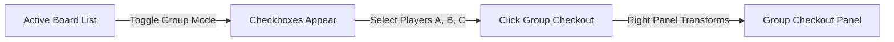

# Feature Spec 17: Group Checkout - UI

## Purpose
Detail the user interface components, cashier interaction states, and screen layouts for multi-player group checkouts. The interface provides checkboxes and multi-select toggles on the **Left Active Board Panel (~60% width)**, which launches a comprehensive group summary, joint payment split sheet, and debt assignment controls in the **Right Context Panel (~40% width)**.

---

## Build Notes
- **Language & Runtime**: Dart, Flutter Desktop for Windows (Material 3).
- **Theme Constraints**: Light mode only, Modern Cashier Calm direction. Spacing utilizes quiet borders, brand yellow `#FBF306` for principal checkout buttons, and soft warning gold for outstanding debt notifications.
- **State Management**: Riverpod (`GroupCheckoutNotifier` controls selected session IDs, shared cart additions, payment entries, and chosen debt recipients).
- **Folder Structure**:
  - `lib/features/checkout/presentation/widgets/group_checkout_panel.dart` (Main Context Panel container)
  - `lib/features/checkout/presentation/widgets/group_member_list.dart` (List showing participants and individual sub-costs)
  - `lib/features/checkout/presentation/widgets/debt_routing_selector.dart` (Controls for assigning outstanding balances)

---

## UI and Workflow

### 1. Initiation: Active Board Multi-Select
1. **Enabling Group Mode**: The cashier clicks the **"Group Checkout Mode"** toggle button (`btnToggleGroupMode`) located in the header of the Active Board.
2. **Interactive Selection**:
   - Checkboxes appear next to all active session cards in the Left Panel.
   - Cashier ticks the boxes for the players participating in the group checkout (e.g., ticking 3 cards for a family).
   - The header of the Active Board dynamically shows: "X Players Selected".
3. **Execution**: The cashier clicks the yellow **"Group Checkout"** action button (`btnGroupCheckout`) at the bottom of the Active Board list.



### 2. Group Checkout Panel Layout (Right Panel)
- **Participant Manifest**: A dense table listing each player's name, their play duration, individual ticket charge (incorporating any individual discounts), and their individual product counts.
- **Shared Products Adder**: Tapping "+ Shared Items" allows adding group-wide products (like mineral water bottles or trampoline socks) which are added to a shared group cart rather than individual accounts.
- **Joint Payment Form**:
  - Displays aggregate Subtotal, Tip field, and Cash Paid / Card Paid input boxes.
  - **Dynamic Underpayment Alert**: If Cash Paid + Card Paid is less than the Subtotal, a dedicated section **"Route Unpaid Balance"** is revealed.
- **Debt Routing Controls**:
  - A dropdown menu lists all players in the group: `Samer Kayyal (Leader)`, `Jana Kayyal`, `Adnan Kayyal`.
  - Cashier selects who receives the debt.
  - Alternatively, the cashier can select **"Split Evenly"** to distribute the remaining balance.
- **Confirm button**: Large, brand-yellow action button (`btnConfirmGroupCheckout`).

```text
+-------------------------------------------------------------+
|                     GROUP CHECKOUT PANEL                    |
| 3 Players Selected                                          |
+-------------------------------------------------------------+
| MEMBERS                                                     |
| 1. Samer Kayyal ................ 1h 30m (Fixed) .. 30,000 SYP|
| 2. Jana Kayyal ................. 1h 00m (Fixed) .. 20,000 SYP|
| 3. Adnan Kayyal ................ 1h 00m (Fixed) .. 20,000 SYP|
+-------------------------------------------------------------+
| SHARED ITEMS (GROUP CART)                                   |
| - 5 x Mineral Water (0.5L) ..................... 10,000 SYP |
+-------------------------------------------------------------+
| BILL SUMMARY                                                |
| Play Subtotal: 70,000 SYP    Product Subtotal: 10,000 SYP   |
| Group Grand Total: 80,000 SYP                               |
+-------------------------------------------------------------+
| PAYMENTS SPLIT                                              |
| Cash Paid: [ 50,000 ] SYP    Card Paid: [ 10,000 ] SYP       |
| Unpaid Balance: 20,000 SYP                                  |
+-------------------------------------------------------------+
| ROUTE UNPAID BALANCE (DEBT)                                 |
| Assign Unpaid Balance to: [ Samer Kayyal (Leader)       v ] |
+-------------------------------------------------------------+
| [x] Print Combined Receipt       [ CONFIRM GROUP CHECKOUT ] |
+-------------------------------------------------------------+
```

### 3. Safety and Validation Checks
- **Old Debt Interception**: If any selected player has outstanding old debt from prior visits, a warnings panel appears listing their names and debt values:
  > ⚠️ **Prior Debt Warning**:
  > - Jana Kayyal has **15,000 SYP** old debt.
  > - *Checkbox*: `cbCollectJanaDebt` ("Collect 15,000 SYP")
  - **Security Rule**: Ticking "Collect" adds 15,000 SYP to the payment requirement and shows it on the receipt as a separate "Debt Settlement" line item.
  - Leaving it unchecked displays a disclaimer warning that the old debt will remain active on Jana's profile and will *not* be cleared by this payment.
- **Empty Group Protection**: If no sessions are selected, the Context Panel displays an empty-state message directing the cashier to select players on the left board.

---

## Edge Cases and Rules
1. **Session Mid-Checkout Lock**:
   - While the Group Checkout form is open in the Right Panel, the selected session cards on the Left Active Board are styled with a diagonal hatching background and locked (cashiers cannot trigger individual checkouts or voids on locked sessions).
2. **Preventing Silent Merging**:
   - The UI **must not** auto-calculate or merge old debt into the new subtotal. The "Group Grand Total" always reflects *only* the current session play fees and current product purchases. Old debts are explicitly listed as separate toggles to prevent receipt fraud.

---

## Tests and Verification

### Widget Tests (`test/features/checkout/group_checkout_widget_test.dart`)
- **Multi-Select Toggle Action**: Open the Active Board. Click "Group Checkout Mode". Click checkboxes on three session cards. Assert that the bottom button displays "Checkout 3 Players" and clicking it successfully loads the Group Checkout Panel in the right panel.
- **Debt Routing Dropdown Interactivity**: Simulate an underpayment state of 10,000 SYP. Verify that the Debt Routing Selector widget renders, click the dropdown, choose player "Samer Kayyal", and confirm that the execution payload assigns the debt to Samer's ID.
- **Prior Debt Checkout Inclusion**: Verify that ticking the "Collect Old Debt" checkbox successfully increments the cash payment requirement and appends a "Prior Debt Collected" line item to the summary.

---

## Acceptance Checklist

| ID | Requirement Details | Check |
| --- | --- | --- |
| AC-17.1 | Verify that the Active Board supports multi-selection checkboxes in Group Mode. | [ ] |
| AC-17.2 | Verify that clicking Group Checkout loads the joint list in the Context Panel. | [ ] |
| AC-17.3 | Verify that shared products added to the group cart update the combined subtotal. | [ ] |
| AC-17.4 | Verify that old debts are listed as separate actionable line items and never merged silently. | [ ] |
| AC-17.5 | Verify that the checkout button locks sessions on the Active Board to prevent concurrent edits. | [ ] |
| AC-17.6 | Verify that submitting group checkout successfully closes all selected sessions and prints a combined receipt. | [ ] |

---

## What success looks like
Cashiers manage group checkouts smoothly during busy hours. Tapping "Group Mode" reveals selection boxes next to jumpers. The cashier checks three kids, taps checkout, and sees a clean combined list. Sharing a bottle of water is handled in a tap. The parent pays half card and half cash; any minor shortfalls are assigned explicitly to the parent's file. The entire family is checked out in a single step, receiving one unified receipt that outlines exactly who jumped, what was purchased, and what was settled.
