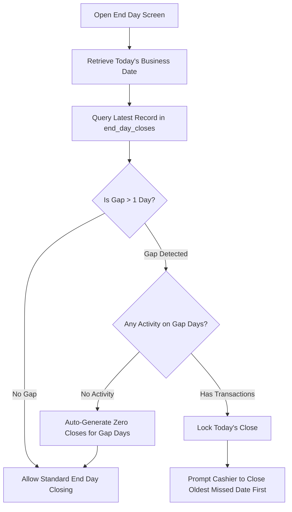

# Feature Specification: End Day Reporting - Domain and Data

## Purpose
Define the business logic, mathematical formulas, timezone boundaries, and database query rules for daily cashier reconciliation. The End Day reporting architecture guarantees that financial figures are frozen in historical snapshots (`end_day_closes`), allowing the business to maintain a flawless audit trail of physical cash and card receipts against expected system ledger calculations.

---

## Build Notes

### Key Technologies
- **Drift (SQLite)**: Core query processor utilizing transactional aggregates for sum, count, and date ranges.
- **timezone (Dart Package)**: Configured strictly to the operational timezone `Asia/Damascus` to calculate daily boundaries regardless of physical server configuration.
- **Freezed**: Dynamic immutable data transfer objects (DTOs) for calculated shifts prior to persistence.

### Folder Structure
- `lib/domain/models/end_day/`
  - `end_day_report.dart`: Freezed model representing expected and counted totals.
  - `business_day_range.dart`: Value object wrapping timezone boundary calculations.
- `lib/domain/services/end_day/`
  - `end_day_calculator.dart`: Computes sums for expected payments, tips, debt issued, and debt collected.
  - `gap_detection_service.dart`: Scans historic logs to detect days that cashiers forgot to close.
- `lib/data/repositories/`
  - `end_day_repository.dart`: Manages read/write transactions for closing snapshots.

---

## Data/Domain/Storage

### Core Storage References
This feature directly maps to the **`end_day_closes`** table defined in [schema-reference.md](../schema-reference.md).
It also performs aggregated queries across:
- **`payments`**: Sums card and cash totals, including tip allocations.
- **`debts`**: Aggregates new debt issued in the date range.
- **`debt_payments`**: Aggregates debt collected in the date range.

### Domain Model: `EndDayReport` (Freezed)
```dart
import 'package:freezed_annotation/freezed_annotation.dart';

part 'end_day_report.freezed.dart';
part 'end_day_report.g.dart';

@freezed
class EndDayReport with _$EndDayReport {
  const factory EndDayReport({
    required String id,
    required DateTime closedAt,
    required String businessDate, // YYYY-MM-DD local format
    required int expectedCash,    // SYP
    required int expectedCard,    // SYP
    required int countedCash,     // SYP
    required int countedCard,     // SYP
    required int cashMismatch,    // SYP (countedCash - expectedCash)
    required int cardMismatch,    // SYP (countedCard - expectedCard)
    required int totalDebtIssued, // SYP
    required int totalDebtCollected, // SYP
    required int totalTips,       // SYP
    required bool isMissedClose,
    required String backupStatus, // 'pending', 'success', 'failed'
  }) = _EndDayReport;

  factory EndDayReport.fromJson(Map<String, dynamic> json) =>
      _$EndDayReportFromJson(json);
}
```

---

## UI and Workflow

### Timezone & Business Day Boundaries
Since the trampoline park can operate past midnight, standard UTC date boundaries are insufficient.
- **Operational Timezone**: `Asia/Damascus`.
- **Shift Boundary Rule**: A single business day for date `YYYY-MM-DD` starts strictly at **06:00:00 AM local time** on that day, and ends at **05:59:59 AM local time** the following morning.
- **Dynamic Conversion**: The system translates these local boundaries into absolute UTC ISO-8601 timestamps when querying Drift database records.

```text
Local Time (Asia/Damascus):
May 22, 06:00:00 AM                                               May 23, 05:59:59 AM
[============================ Business Date: 2026-05-22 ============================]
     \                                                                           /
      \  Converted dynamically to UTC for SQLite querying:                      /
       UTC Time: 2026-05-22T03:00:00Z                      UTC: 2026-05-23T02:59:59Z
```

### Missed-Close Gap Detection Workflow
To prevent cashiers from bypassing closeouts, the system runs an automated check at login and when opening the End Day screen:



1. **Inactivity Auto-Close**: If a gap day has zero recorded payments, zero session check-ins, and zero product sales, the system automatically inserts a zero-value snapshot record into the `end_day_closes` table with `expected_cash = 0`, `expected_card = 0`, `is_missed_close = true`.
2. **Forced Sequential Close**: If a gap day contains transactions, the UI locks access to the current date's close. The cashier is shown a blocking interface requiring them to perform closeout inputs for the oldest active gap date first.

---

## Edge Cases and Rules

### 1. Calculated Expected Totals Formulas
All monetary calculations are evaluated inside a single database transaction to prevent intermediate state anomalies:
- **`Expected Cash`**:
  $$\sum \text{amount\_paid} \text{ from } \mathbf{payments} \text{ where } \text{payment\_method} = \text{'cash'} \text{ and } \text{status} \neq \text{'voided'}$$
  *(Note: Tips are stored within `payments.amount_paid` and are therefore natively reconciled inside expected cash/card.)*
- **`Expected Card`**:
  $$\sum \text{amount\_paid} \text{ from } \mathbf{payments} \text{ where } \text{payment\_method} = \text{'card'} \text{ and } \text{status} \neq \text{'voided'}$$
- **`Total Debt Issued`**:
  $$\sum \text{original\_amount} \text{ from } \mathbf{debts} \text{ where } \text{status} \neq \text{'voided'}$$
- **`Total Debt Collected`**:
  $$\sum \text{amount\_applied} \text{ from } \mathbf{debt\_payments} \text{ (joined to non-voided payments)}$$
- **`Total Tips`**:
  $$\sum \text{tip\_amount} \text{ from } \mathbf{payments} \text{ where } \text{status} \neq \text{'voided'}$$

### 2. Debt Payment Rules
Debt collections represent physical currency flowing into the register. Therefore, the payment record associated with a debt payment increases the expected cash or card total *on the day of collection*, not the day the debt was originally recorded.

### 3. Voids and Corrections Exclusion
- If a session or product sale is voided by an administrator, its associated payment status is set to `'voided'`.
- Voided payments are completely excluded from expected totals queries.
- Original payment records are never deleted; their status change automatically filters them out of aggregate sums.

### 4. Active Check-in Lockout
- **Invariant**: The system blocks the generation of a closing report if any active sessions (`status = 'active'` or `status = 'overdue'`) exist in the database.
- Cashiers must check out or void all active board players before closing the shift.

---

## Tests and Verification

### Unit Tests (`test/domain/end_day/`)
1. **Business Day Boundary Calculations**:
   - Assert that local date `2026-05-22` correctly maps to UTC `2026-05-22T03:00:00Z` (start) and `2026-05-23T02:59:59Z` (end) under Daylight Saving time adjustments in Damascus.
2. **Calculator Logic**:
   - Mock a database state containing:
     - 2 Cash payments of 15,000 SYP (one including a 2,000 SYP tip).
     - 1 Card payment of 30,000 SYP.
     - 1 Voided cash payment of 10,000 SYP.
     - 1 Debt issuance of 50,000 SYP.
     - 1 Debt collection payment of 12,000 SYP (cash).
   - Assert `expectedCash` equals $15,000 + 15,000 + 12,000 = 42,000$ SYP.
   - Assert `expectedCard` equals $30,000$ SYP.
   - Assert `totalTips` equals $2,000$ SYP.
   - Assert `totalDebtIssued` equals $50,000$ SYP.
   - Assert `totalDebtCollected` equals $12,000$ SYP.

### Data & Integration Tests (`test/data/end_day/`)
1. **Gap Detection Routine**:
   - Seed database with a closeout record for `2026-05-20` and transactions for `2026-05-22`.
   - Run gap detection and verify it flags `2026-05-21` as a missed-close date.
   - Assert that if `2026-05-21` contains zero records, calling `autoCloseInactivityGaps()` inserts a zero-valued closeout snapshot for that day.
2. **Transaction Safeguard**:
   - Verify that trying to insert an `end_day_closes` snapshot throws a validation error if there are active check-in sessions.

---

## Acceptance Checklist

| ID | Requirement Details | Status |
|---|---|---|
| **EDD-01** | Shift boundary maps to `06:00:00 AM` to `05:59:59 AM` local Damascus time. | [ ] |
| **EDD-02** | Expected cash/card calculation logic accurately aggregates all non-voided transaction payments. | [ ] |
| **EDD-03** | Tips are aggregated correctly and included inside standard expected cash/card fields. | [ ] |
| **EDD-04** | Debt payments increase the expected physical total on the day they are collected. | [ ] |
| **EDD-05** | Voided payments are completely filtered out of daily closeout aggregates. | [ ] |
| **EDD-06** | System blocks closing execution if any player sessions are still active or overdue. | [ ] |
| **EDD-07** | Gap detection forces sequential closeouts starting from the oldest missing day with transactions. | [ ] |
| **EDD-08** | Inactivity days without transactions are auto-closed with zeroed values. | [ ] |

---

## What Success Looks Like
At 11:30 PM, a cashier opens the End Day module. The system queries thousands of payments, ignoring admin voids and correct adjustment entries, and calculates exactly 340,000 SYP expected cash and 180,000 SYP expected card. When the cashier attempts to execute the report, the database immediately validates that zero active players are on the board, locks down the records, and writes a permanent, frozen `end_day_closes` snapshot containing these figures, guaranteeing they remain completely unchanged even if future billing adjustments are posted.
