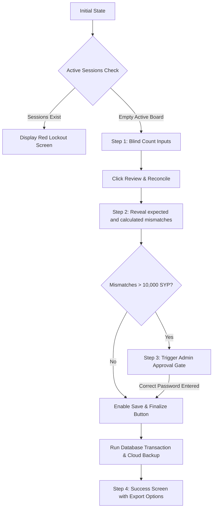

# Feature Specification: End Day Reporting - UI

## Purpose
Provide a foolproof, high-efficiency user interface for cashiers to reconcile register funds at the end of their shift. The design enforces "blind closing" to eliminate counting bias, presents clear financial summary cards, blocks closeouts if active sessions remain, and locks down mismatch submissions behind administrative authorization.

---

## Build Notes

### Key Technologies
- **Flutter Material 3 (Light Mode, Calm Cashier Visuals)**.
- **Riverpod**: Manages the screen's interactive multi-state machine.
- **flutter_animate**: For smooth transitions between counting, reviewing, and success states.
- **Brand Colors**: Uses Neutrals for tables, brand yellow `#FBF306` strictly for the primary confirmation button, and clear red/amber status colors for mismatch highlights.

### Folder Structure
- `lib/features/reports/presentation/`
  - `end_day_screen.dart`: The core module screen integrating the split layout.
  - `widgets/active_sessions_lockout.dart`: Full-screen blocking warning when active check-ins remain.
  - `widgets/blind_counting_panel.dart`: Form fields for entering cash/card totals with quick-add helpers.
  - `widgets/shift_summary_card.dart`: Data display for finalized expected vs counted values.
  - `widgets/admin_approval_gate.dart`: Inline admin password verification prompt for high mismatch values.

---

## Data/Domain/Storage

### References
This UI interacts exclusively with the data models, calculators, and repositories defined in:
- [17a-end-day-reporting-domain-and-data.md](17a-end-day-reporting-domain-and-data.md)
- [schema-reference.md](../schema-reference.md) (`end_day_closes` table)

---

## UI and Workflow

### 1. Split-Panel Context Integration
- **Left Panel (~60%)**: Displays a read-only list of checked-out player sessions for the current day. If players are still active, this panel instead flashes a warning showing their names and checkers-in, guiding checkout.
- **Right Panel (~40% Context Panel)**: The active **End Day Close Console**.

```text
+------------------------------------------+-----------------------------------+
|               LEFT PANEL                 |            RIGHT PANEL            |
|       Daily Check-out Transactions       |          End Day Console          |
|                                          |                                   |
| [Checked Out] Samer K. (Socks + 1 Hour)  | Counted Cash (SYP):               |
|               18,000 SYP (Cash)          | [ 150,000               ] SYP     |
|                                          |                                   |
| [Checked Out] Maya S. (Subscription entry)| Counted Card (SYP):               |
|               0 SYP (Sub Card)           | [ 80,000                ] SYP     |
|                                          |                                   |
| [Checked Out] Anas M. (Water Bottle)     | [ +5k ] [ +10k ] [ +50k ] [Clear] |
|               3,000 SYP (Card)           |                                   |
|                                          | [   Review and Reconcile   ]      |
+------------------------------------------+-----------------------------------+
```

### 2. The Multi-Step Closeout Workflow



#### Step 1: Blind Count Panel
- **Rule**: Expected totals are strictly hidden to prevent cashiers from writing numbers that match the system rather than physical currency.
- Cashier enters values into two inputs:
  - **Counted Cash (SYP)**
  - **Counted Card (SYP)**
- The inputs display in a large, readable monospace font with auto-formatted thousands separators (e.g., `150,000`).
- **Quick-Add Buttons**: Positioned below the inputs for fast desktop input:
  - `+1,000` | `+5,000` | `+10,000` | `+50,000` | `Clear`
- Clicking **"Review and Reconcile"** locks the input fields and progresses to Step 2.

#### Step 2: The Shift Summary Dashboard
Once clicked, the right panel expands with the shift summary breakdown:

```text
+----------------------------------------------+
|             RECONCILIATION SUMMARY           |
+----------------------------------------------+
| Cash Balance:                                |
|   System Expected:               150,000 SYP |
|   Physical Counted:              148,000 SYP |
|   Cash Mismatch:                  -2,000 SYP  (▼ Under)
+----------------------------------------------+
| Card Balance:                                |
|   System Expected:                80,000 SYP |
|   Physical Counted:               80,000 SYP |
|   Card Mismatch:                       0 SYP  (● Balanced)
+----------------------------------------------+
| Shift Metrics:                               |
|   Debt Issued:                    50,000 SYP |
|   Debt Collected:                 12,000 SYP |
|   Tips Collected:                  3,000 SYP |
+----------------------------------------------+
```

- **Mismatch Highlights**:
  - **Balanced (0 SYP Difference)**: Light green background card with checkmark icon.
  - **Unbalanced (Under/Over)**: Bold amber/red border with a warning icon and negative or positive indicators.

#### Step 3: Admin Approval Override
- If the absolute mismatch value of **either** cash or card exceeds `10,000 SYP`, standard submission is locked.
- A card overlays the console: **"Reconciliation Mismatch Exceeds Cashier Limit. Admin Password Required to Close."**
- Admin must enter the plaintext password. Entering the correct password releases the lock, adds the authorization tag to the pending transaction, and registers an administrative audit event.

#### Step 4: Success and Reporting Actions
- Once submitted, the screen displays a full-screen completion state.
- **Action Buttons**:
  - **"Print Daily Report PDF"** (Triggering local thermal/standard printing).
  - **"Export Excel CSV"** (Triggering path selection dialogue).
  - **"Restart Dashboard"** (Restarts app shell back to the clean player board).

---

## Edge Cases and Rules

### 1. Active Check-in Safeguard
- UI queries Drift dynamically to check if any row exists in `sessions` where `status` is `'active'` or `'overdue'`.
- If found, the entire right console displays a red alert blocking input, and links to each active session on the left Active Board are highlighted with flashing outlines.

### 2. Format on Keypress
- The text inputs use a custom formatter `ThousandsSeparatorFormatter` which formats numbers on the fly (e.g. typing `25000` translates to `25,000` instantly) to prevent typing errors.
- Decimal points and alphabetic keys are completely rejected.

### 3. Password Verification Rules
- The admin password entered is verified against the `'admin_password'` row in `system_settings`.
- Entering a wrong password flashes a error shakes the input, and increments a security audit failure counter.

---

## Tests and Verification

### Widget Tests (`test/features/reports/`)
1. **Blind Input Form Validation**:
   - Verify that when the screen opens, the expected cash/card values do not exist in the widget tree.
   - Assert that non-numeric characters entered into the inputs are discarded.
   - Verify that quick-add helper buttons correctly increment the cash counted controller value.
2. **Reconciliation Card Rendering**:
   - Enter `150000` cash and `80000` card. Click reconcile.
   - Assert that expected vs counted rows render, and that a mismatch under state of `-2,000 SYP` appears.
3. **Lockout and Overrides**:
   - Simulate a cash mismatch of `15,000 SYP` (over the limit).
   - Assert that the "Finalize Shift Close" button is disabled.
   - Assert that entering the wrong admin password displays a validation error message.
   - Assert that entering the correct admin password unlocks the finalize button.
4. **Active Sessions Lockout widget**:
   - Seed one active session on the board. Assert that the inputs form is replaced entirely by the active sessions lockout warning widget.

---

## Acceptance Checklist

| ID | Requirement Details | Status |
|---|---|---|
| **EDU-01** | UI occupies the persistent right context panel (~40%) with active checkouts on left (~60%). | [ ] |
| **EDU-02** | Expected totals are completely hidden (blind close) until the counted amounts are submitted. | [ ] |
| **EDU-03** | Text inputs auto-format thousands separators on the fly and block decimal values. | [ ] |
| **EDU-04** | Quick-add helper buttons (+1k, +5k, +10k, +50k) are operational. | [ ] |
| **EDU-05** | Displays green markers for balanced totals and amber/red warnings for mismatches. | [ ] |
| **EDU-06** | Mismatch values exceeding +/- 10,000 SYP lock standard submit and force admin password entry. | [ ] |
| **EDU-07** | Active session warning blocks closing inputs entirely if checked-in players exist. | [ ] |
| **EDU-08** | Success state presents quick-action buttons for PDF Printing and CSV export. | [ ] |

---

## What Success Looks Like
A cashier completes their shift. The Active Board on the left is clean. On the right, they enter counted cash (`245,000`) and card (`150,000`) utilizing the quick-add buttons. Upon clicking reconcile, the system reveals they are short `5,000 SYP` on cash. Since this is within the `10,000 SYP` cashier limit, the system highlights the mismatch warning but allows finalizing the closeout. The cashier clicks finalize, a database snapshot freezes, the GCP sync dot flashes to record backup success, and the daily close report is printed automatically on the front-desk printer.
