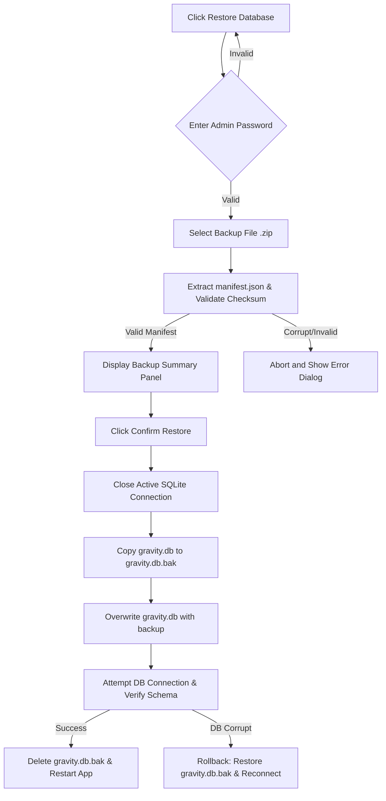

# Feature Spec 19: Backup, Restore, and Cloud Status

## Purpose
Ensure robust, offline-first data protection and seamless disaster recovery for the trampoline park desktop application. While SQLite is the local, authoritative source of truth, this feature provides automated background backups and admin-supervised cloud restoration via Google Cloud Storage (GCP) with absolute safety safeguards.

---

## Build Notes

### Key Technologies
- **Flutter Desktop for Windows (Material 3)**.
- **Drift**: Local SQLite ORM boundary, requires closing the connection pool safely prior to restore replacement.
- **archive (Dart Package)**: For packaging the SQLite database and metadata manifest into a standard, compressed zip archive.
- **crypto (Dart Package)**: For generating SHA-256 checksum hashes to guarantee data integrity of the database file.
- **http (Dart Package)**: For native Windows compatibility when interacting with the GCP Cloud Storage JSON API, bypassing heavy cloud SDKs.
- **flutter_dotenv**: For reading the gitignored `.env` file containing GCP credentials.

### Folder Structure
- `lib/core/backup/`
  - `backup_service.dart`: Handles zip packaging, manifest generation, GCP API upload/download, and local validation.
  - `restore_service.dart`: Manages database lock down, safety copying, validation checks, and replacement execution.
- `lib/features/settings/presentation/`
  - `backup_settings_panel.dart`: Right-panel configuration, manual backup triggers, and historical runs.
  - `restore_dialog.dart`: Admin-protected file selection, manifest preview, and execution feedback.

---

## Data/Domain/Storage

### Core Storage References
This feature directly utilizes the following tables defined in [schema-reference.md](../schema-reference.md):
- **`backup_runs`**: Logs the details of each backup attempt (manual, scheduled, app close, or end-day).
- **`audit_events`**: Logs restore actions and system settings changes under type `'backup_restore'`.
- **`system_settings`**: For general restore settings.

### Backup Package Manifest Structure
Each backup is a `.zip` archive containing exactly two files:
1. `gravity.db` (the active SQLite database file).
2. `manifest.json` (metadata for integrity and validation).

The `manifest.json` structure is strictly defined as follows:

```json
{
  "backup_version": "1.0.0",
  "generated_at": "2026-05-22T17:31:13Z",
  "schema_version": 4,
  "db_sha256": "a1b2c3d4e5f6g7h8i9j0k1l2m3n4o5p6q7r8s9t0u1v2w3x4y5z6a7b8c9d0e1f2",
  "records": {
    "players": 1420,
    "sessions": 8540,
    "payments": 9210,
    "products": 12,
    "product_sales": 320
  }
}
```

### Local Directory Boundaries
- **SQLite Database Path**: `<appDataDir>\gravity.db`
- **Local Temporary Folder**: `<appDataDir>\temp_backups\` (used to build zip packages and download restore candidates).
- **Local Restore Safety Copy**: `<appDataDir>\gravity.db.bak` (created immediately before database replacement).

---

## UI and Workflow

### 1. Global GCP Connection Status Indicator
- Positioned permanently in the top-right corner of the primary application shell header.
- **States**:
  - **Connected (Green Dot)**: GCP credentials loaded successfully and the latest ping to GCP API returned HTTP 200. Hovering displays: *"Cloud Sync Online. Last backup: [Relative Time]"*.
  - **Connection Failed / Offline (Amber/Red Dot)**: Cloud bucket unreachable. Hovering displays: *"Cloud Sync Offline. Running locally (Offline First)"*.
  - **GCP Unconfigured (Grey Dot)**: `.env` file missing credentials. Hovering displays: *"Cloud Backups Unconfigured"*.
- **Interaction**: Clicking the status dot opens the Settings page directly to the Cloud Settings tab.

```text
+-----------------------------------------------------------------------------+
| Gravity Trampoline Park  [Players] [Catalog] [Reports] [Settings]  (●) Online|
+-----------------------------------------------------------------------------+
```

### 5. Setup Screen GCP Connectivity Test
- During the setup process, the administrator enters configurations and triggers a connection test.
- If it fails, they can bypass it with **"Skip Cloud Setup"** to run the system in local-only mode.

### 3. Manual Backup and History Panel
- Located in **Settings > Backups**.
- Contains a large button: **"Trigger Manual Cloud Backup"**.
- Displays a table showing the 10 most recent runs from `backup_runs` with columns: *Triggered At, Type, Status, Filename, and Error Details*.
- While running, displays a linear progress bar with detailed steps: *"1/3 Packaging Database..."*, *"2/3 Calculating Checksums..."*, *"3/3 Uploading to GCP Bucket..."*.

### 4. Admin-Protected Restore Flow
The restore flow is extremely high-risk and is designed with strict safeguards to prevent catastrophic data loss:



- **Backup Summary Panel Content**:
  - **Generated On**: ISO-8601 UTC parsed to `Asia/Damascus` timezone format.
  - **Database Size**: in Megabytes.
  - **Key Metrics Table**:
    - Registered Players: `Count`
    - Historic Sessions: `Count`
    - Financial Payments: `Count`
- **Execution Step Dialog**: Shows active progress with a circular progress indicator. If success, requires an explicit button click to **"Restart Application"**.

---

## Edge Cases and Rules

### 1. Cloud Backup Failures
- Backup failures must **never** block cashier checkout, check-in, or database mutations.
- If a background backup fails (scheduled or end-day), the system writes a `'failed'` status and the error message to the local `backup_runs` table.
- A non-intrusive red badge appears on the Settings icon in the side rail. No aggressive popup dialogs are shown during customer interactions.

### 2. Absolute Secret Exclusion
- Backup packages **must never** include the local `.env` file, local configuration files, employee session metadata, system log files (`app.log`), or exported PDF/CSV documents.
- Only the SQLite `gravity.db` file and the dynamically generated `manifest.json` are packaged inside the zip.

### 3. Verification Safeguards (Manifest & Checksums)
- The SHA-256 hash of the extracted `gravity.db` is calculated prior to replacement.
- The hash is compared to `db_sha256` inside `manifest.json`.
- The target database schema version inside `manifest.json` is checked against the application's supported Drift schema version.
- **Rule**: If the checksum does not match, or the schema version in the backup is newer than the app's software version, the restore is blocked immediately, and the temporary files are securely deleted.

### 4. Rollback and Recovery
- If the replacement database fails to load (e.g., SQLite file locking error, schema corruption during initialization), the system must immediately delete the corrupted `gravity.db`, copy the `gravity.db.bak` safety file back to `gravity.db`, and reopen the database pool.
- An audit event of type `'backup_restore'` is written detailing the failure and recovery action.

---

## Tests and Verification

### Unit Tests (`test/domain/backup/`)
1. **Zip Packaging Test**:
   - Assert that packaging a dummy database creates a zip file containing exactly the database and `manifest.json`.
   - Assert that local secrets are excluded even if present in the target folders.
2. **Checksum Integrity Test**:
   - Assert that the generated SHA-256 hash matches the database file contents.
   - Assert that altering even a single byte in the database file after hashing triggers a manifest mismatch failure.
3. **Manifest Version Guard**:
   - Verify that backup files with schema versions higher than the application schema version are rejected.

### Integration & Data Tests (`test/data/backup/`)
1. **Connection Lifecycle Test**:
   - Verify that Drift correctly closes all active connection pools prior to restoring, and reopen connections successfully afterward.
2. **Database Overwrite and Rollback Test**:
   - Simulate a corrupted restore file. Assert that the recovery routine successfully rolls back to the original `gravity.db.bak` copy, and database queries continue to run on the old data.

### Widget & View Model Tests (`test/features/backup/`)
1. **Status Indicator States**:
   - Mock GCP HTTP responses and verify the status indicator updates between Green (Online), Red (Failed), and Grey (Unconfigured) as expected.
2. **Setup Connectivity Test Widget**:
   - Verify the "Skip Cloud Setup" button functions and allows completing the setup wizard if cloud check fails.

---

## Acceptance Checklist

| ID | Requirement Details | Status |
|---|---|---|
| **BAC-01** | Backup packages are standard compressed ZIPs containing only `gravity.db` and `manifest.json`. | [ ] |
| **BAC-02** | Checksum verification is calculated using SHA-256 and matched against the manifest. | [ ] |
| **BAC-03** | GCP credentials are read solely from `.env` and never compiled or saved into SQLite. | [ ] |
| **BAC-04** | Backup failures write logs to `backup_runs` and update UI status without blocking cashier workflows. | [ ] |
| **BAC-05** | Restore requires admin password entry, displaying a full structural preview of records. | [ ] |
| **BAC-06** | Restore process takes a local safety copy `gravity.db.bak` before making any file swaps. | [ ] |
| **BAC-07** | Automated database rollback is executed if the restored file fails initial verification or Drift loading. | [ ] |
| **BAC-08** | Setup screen allows skipping the cloud connectivity test gracefully. | [ ] |

---

## What Success Looks Like
An administrator enters settings, prompts a manual backup, and watches the progress bar complete successfully while a cashier is checking out a player. Later, during a disaster recovery drill, the administrator inputs the password, selects the backup zip, views a correct summary of historic players, and clicks restore. The database swaps seamlessly, the system restarts, and every single transaction, player phone, and inventory record matches the backup state exactly without a single byte of corruption.
